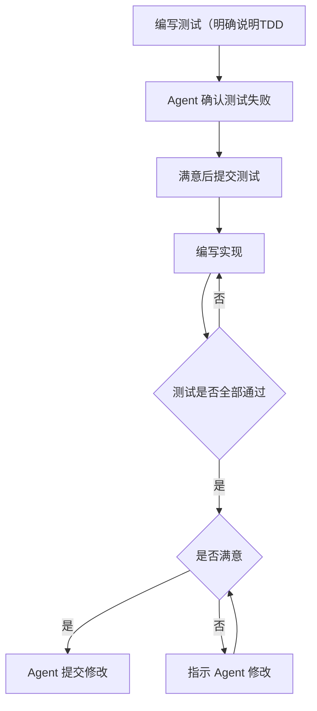

> [!note] 原文
> https://cursor.com/cn/blog/agent-best-practices

<iframe src="https://cursor.com/cn/blog/agent-best-practices" allow="fullscreen" allowfullscreen="" style="height:100%;width:100%; aspect-ratio: 16 / 9; "></iframe>

# Note
## Harness
* 不同模型有不同的风格，cursor 会为不同的模型设置不同的提示词约束
## Plan Mode
* 建议在让 AI 开始写之前先用 Plan Mode。本质上是让 AI 为你生成做某件事件的计划。同时可以和 AI交流一些关键问题。主要是人的脑子可能会漏掉一些东西，AI 可能想的更全面一点。这个过程也可以让 AI的上下文更完善
* 并不是每个任务都需要详细的计划。对于一些简单的小改动，或是你已经做过很多次的任务，直接交给 agent 处理就可以。
* **从计划重新开始** ：如果 AI 已经走进死胡同，多次修改也无法符合预期，不同回退修改，重新细化计划，把你的需求描述得更具体，避免模型再犯之前的错误。
## 上下文
能否让 Agent 获取正确的上下文是 AI 能否正确完成工作的关键。
* **保持简单：** 如果你知道确切的文件，就在提示中引用它；如果不知道，就交给 agent 去查找。包含不相关的文件可能会让 agent 弄不清哪些内容才是重要的。这点对 AI 的伤害可能比缺乏上下文更大。Agent 的搜索功能足够强大，很大程度上能找到对的文件。所以除非你非常确定，还是让 AI 自己找吧。
* 过长的对话可能会让 Agent 失去焦点。经过多轮对话和多次总结后，上下文里会积累噪音，Agent 容易被分散注意力或切换到不相关的任务。如果你发现 Agent 的效果在下降，就是该开始一个新对话的时候了。如果 Agent 的状态明显异常了，开始一个新对话。
## Rules and Skills
* Rules 要更加聚焦：一些必要的，不太会变动的要求，以及背景知识。**尽可能多用文件引用，使 Rules 保持精简和少修改** 。下面是 cursor 的官方示例，主要是一些常用的命令，代码风格约束，以及工作流。这里的内容如果多的话也都可以拆到单独的文件中去。主要是让 AI 保持聚焦，~~以及省 token~~。
```markdown
# Commands

- `npm run build`: Build the project
- `npm run typecheck`: Run the typechecker
- `npm run test`: Run tests (prefer single test files for speed)

# 代码风格

- 使用 ES 模块(import/export),而非 CommonJS(require)
- 尽可能使用解构导入:`import { foo } from 'bar'`
- 参考 `components/Button.tsx` 了解标准组件结构

# Workflow

- Always typecheck after making a series of code changes
- API routes go in `app/api/` following existing patterns
```
* **动态迭代 Rules**: 只有当你发现 agent 反复犯同样的错误时，再新增规则。在真正理解自己的模式之前，不要过度优化。在使用中逐渐完善自己的 Rules 工作流。
* Skills动态加载：主要是领域知识，模型按需取用。不过它的 frontmatter 要进初始 Context，所以需要尽量精简
* 总之，所有需要进初始 Context 的东西都需要**简洁、清晰、正确、关键**
## 可视化
* 善用多模态模型的可视化功能，对于语言不好描述的问题，可以直接截图扔给 Agent。
## TDD
非常典型的AI开发流程，通过编写测试明确 AI 的目标。测试可以让智能体在不断修改的同时评估结果，并逐步改进直到全部通过。


* 一些需要注意的点：
	* **编写测试**时， 要明确说明你在做 TDD，这样它就会避免为尚不存在的功能编写模拟实现。
	* **确认测试失败**时，明确说明在这个阶段不要编写实现代码。
	* **编写实现**时，指示它不要修改测试。

## 读代码
* 非常推荐用 AI 来读代码，是快速上手陌生代码库的最高效方式之一。
* 像向队友请教一样提问：
	- “这个项目里的日志是如何运作的？”
	- “我该如何添加一个新的 API endpoint？”
	- “`CustomerOnboardingFlow` 处理了哪些边界情况？”
	- “为什么我们在第 1738 行调用的是 `setUser()` 而不是 `createUser()`？”
## 创建PR
诸如创建 PR 这种重复性的工作也可以方便的委派给 Agent
```
为当前更改创建 Pull Request。

1. 使用 `git diff` 查看已暂存和未暂存的更改
2. 根据更改内容编写清晰的提交信息
3. 提交并推送到当前分支
4. 使用 `gh pr create` 创建 Pull Request,并提供标题和描述
5. 完成后返回 PR URL
```

## Code Review
和读代码类似，AI Review 代码也很厉害
## 并行运行 Agent
* 多个子任务，每个有自己的 worktree，互不干扰，通过 Apply 合回主线
* 一种非常强大的使用方式是：让同一个提示词同时在多个模型上运行。从下拉菜单中选择多个模型，提交你的提示词，然后将结果并排比较。Cursor 还会提示它认为最优的解决方案。
## 云端 Agent
* 云端 Agent 在远程沙箱中运行，因此你可以合上电脑，稍后再回来查看结果。
* 云端 Agent 在幕后是这样工作的：
	1. 描述任务以及相关上下文
	2. Agent 克隆你的仓库并创建一个分支
	3. 它会自主工作，并在完成后打开一个 pull request
	4. 任务完成后你会收到通知（通过 Slack、电子邮件或 Web 界面）
	5. 审查改动并在准备好后合并
## Debug Mode
* 它最适合用于：
	- 你能复现但搞不清原因的 bug
	- **竞争条件**和**时序问题**
	- 性能问题和**内存泄漏**
	- 之前能正常工作、但现在出现回归的问题
* 提供更多的排查方向、思路和手段
## Summary
> [!note]
这段写的挺好，直接贴过来：


那些能最大化利用 agent 的开发者通常有一些共同特点：

* ***他们会写具体的提示。** 指令越具体，agent 的成功率就越高。对比一下“add tests for auth.ts”和“Write a test case for auth.ts covering the logout edge case, using the patterns in `__tests__/` and avoiding mocks.”。

* ***他们会不断迭代自己的配置。** 从简单开始。只有当你发现 agent 一再犯同样的错误时，才添加规则。只有当你摸索出一个想要重复使用的工作流程时，才添加命令。在真正理解自己的模式之前，不要过度优化。

* ***他们会认真 review。** AI 生成的代码看起来可能是对的，但实际上可能存在细微错误。阅读 diff，并认真进行 review。agent 工作得越快，你的 review 流程就越重要。

* ***他们会提供可验证的目标。** agent 无法修复它“看不见”的问题。使用强类型语言，配置 linters，并编写测试。给 agent 明确的信号，以判断更改是否正确。

* ***他们把 agent 当作有能力的协作者。** 让它给出计划，要求它解释，对你不认可的方案要敢于提出质疑。

Agent 正在快速进化。即使模式会随着新模型而变化，我们也希望这些经验能帮助你在使用编程 agent 时更高效地完成工作。


