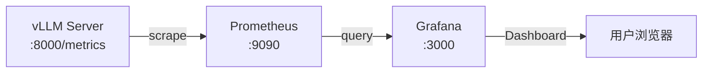

---
tags:
  - vllm
  - monitoring
  - prometheus
  - grafana
date: 2026-06-09
---

# vLLM 监控：使用 Binary 部署 Prometheus + Grafana

> 参考文档：[vLLM Official Example - Prometheus & Grafana](https://docs.vllm.ai/en/v0.7.2/getting_started/examples/prometheus_grafana.html)
>
> 本文档基于官方 Docker 部署方案改写，改为使用 **Binary 直接部署** Prometheus 和 Grafana，适用于不方便使用 Docker 的服务器环境。

## 整体架构



vLLM 的 OpenAI-compatible server 默认开启 Prometheus metrics endpoint（`/metrics`），Prometheus 定时拉取这些指标，Grafana 再从 Prometheus 查询数据进行可视化。

---

## 1. 启动 vLLM Server

```bash
vllm serve mistralai/Mistral-7B-v0.1 \
    --max-model-len 2048 \
    --disable-log-requests
```

启动后可通过以下命令验证 metrics endpoint 是否正常：

```bash
curl http://localhost:8000/metrics
```

> **Tip**: `--disable-log-requests` 可以减少日志噪声，方便观察监控指标。

---

## 2. 安装并启动 Prometheus（Binary）

### 2.1 下载

前往 [Prometheus Download Page](https://prometheus.io/download/) 下载对应平台的 binary，或直接用命令行：

```bash
# macOS (Apple Silicon)
curl -sLO https://github.com/prometheus/prometheus/releases/download/v2.53.0/prometheus-2.53.0.darwin-arm64.tar.gz
tar xzf prometheus-2.53.0.darwin-arm64.tar.gz
cd prometheus-2.53.0.darwin-arm64

# Linux (amd64)
curl -sLO https://github.com/prometheus/prometheus/releases/download/v2.53.0/prometheus-2.53.0.linux-amd64.tar.gz
tar xzf prometheus-2.53.0.linux-amd64.tar.gz
cd prometheus-2.53.0.linux-amd64
```

### 2.2 编写配置文件

创建 `prometheus.yml`（放在 Prometheus 目录下任意位置均可）：

```yaml
global:
  scrape_interval: 5s        # 每 5 秒采集一次
  evaluation_interval: 30s    # 每 30 秒评估一次 rules

scrape_configs:
  - job_name: vllm
    static_configs:
      - targets:
          - 'localhost:8000'   # 直接用 localhost，无需 Docker 网络
```

> **与 Docker 版本的区别**：Docker 版需要使用 `host.docker.internal:8000` 来访问宿主机上的 vLLM，binary 版直接使用 `localhost:8000`。

### 2.3 启动 Prometheus

```bash
./prometheus --config.file=prometheus.yml
```

启动后访问 `http://localhost:9090` 即可打开 Prometheus Web UI。

可以通过 `Status -> Targets` 页面确认 vLLM target 状态为 **UP**。

---

## 3. 安装并启动 Grafana（Binary）

### 3.1 下载

前往 [Grafana Download Page](https://grafana.com/grafana/download) 下载，或用命令行：

```bash
# macOS (Apple Silicon)
curl -sLO https://dl.grafana.com/oss/release/grafana-11.2.0.darwin-arm64.tar.gz
tar xzf grafana-11.2.0.darwin-arm64.tar.gz
cd grafana-v11.2.0

# Linux (amd64)
curl -sLO https://dl.grafana.com/oss/release/grafana-11.2.0.linux-amd64.tar.gz
tar xzf grafana-11.2.0.linux-amd64.tar.gz
cd grafana-v11.2.0
```

### 3.2 启动 Grafana

```bash
./bin/grafana server
```

启动后访问 `http://localhost:3000`，默认登录凭据：

| | |
|---|---|
| 用户名 | `admin` |
| 密码 | `admin` |

首次登录会提示修改密码，可以跳过。

---

## 4. 配置 Grafana

### 4.1 添加 Prometheus 数据源

1. 打开 `http://localhost:3000/connections/datasources/new`
2. 选择 **Prometheus**
3. 设置 Prometheus Server URL 为：

```
http://localhost:9090
```

> **与 Docker 版本的区别**：Docker 版需要使用 `http://prometheus:9090`（Docker 内部 DNS），binary 版直接使用 `http://localhost:9090`。

4. 点击 **Save & Test**，看到绿色确认即可

### 4.2 导入 Dashboard

从 vLLM 仓库下载官方 Grafana Dashboard JSON：

```bash
curl -sLO https://raw.githubusercontent.com/vllm-project/vllm/v0.7.2/examples/online_serving/prometheus_grafana/grafana.json
```

然后在 Grafana 中导入：

1. 打开 `http://localhost:3000/dashboard/import`
2. 上传 `grafana.json` 文件
3. 选择 `Prometheus` 作为数据源
4. 点击 **Import**

---

## 5. 生成测试流量（可选）

下载数据集并运行 benchmark 来验证监控面板是否有数据：

```bash
# 下载 ShareGPT 数据集
wget https://huggingface.co/datasets/anon8231489123/ShareGPT_Vicuna_unfiltered/resolve/main/ShareGPT_V3_unfiltered_cleaned_split.json

# 运行 benchmark
python3 benchmark_serving.py \
    --model mistralai/Mistral-7B-v0.1 \
    --tokenizer mistralai/Mistral-7B-v0.1 \
    --endpoint /v1/completions \
    --dataset-name sharegpt \
    --dataset-path ShareGPT_V3_unfiltered_cleaned_split.json \
    --request-rate 3.0
```

---

## 6. Dashboard 面板说明

导入的 Dashboard 包含 **10 个面板**，分为 5 行布局：

| 行 | 左侧面板 | 右侧面板 |
|---|---|---|
| 1 | **E2E Request Latency** — 端到端请求延迟 P99/P95/P90/P50/均值 | **Token Throughput** — Prompt Tokens/s 和 Generation Tokens/s |
| 2 | **Time Per Output Token Latency** — 每个 output token 的延迟 | **Scheduler State** — Running/Swapped/Waiting 请求数 |
| 3 | **Time To First Token Latency** — TTFT 延迟 P99~P50 + 均值 | **Cache Utilization** — GPU/CPU KV Cache 使用率 |
| 4 | **Request Prompt Length** — Prompt 长度分布热力图 | **Request Generation Length** — 生成长度分布热力图 |
| 5 | **Finish Reason** — 按完成原因统计请求数 | **Queue Time** — 请求排队时间 |

Dashboard 支持两个模板变量：
- **DS_PROMETHEUS** — 数据源选择器
- **model_name** — 自动从指标中提取可用的模型名

---

## 7. 关键 Prometheus 指标速查

| 指标名 | 说明 |
|---|---|
| `vllm:e2e_request_latency_seconds_bucket` | 端到端请求延迟（histogram） |
| `vllm:time_to_first_token_seconds_bucket` | 首 token 延迟 TTFT（histogram） |
| `vllm:time_per_output_token_seconds_bucket` | Token 间延迟 ITL（histogram） |
| `vllm:prompt_tokens_total` | 处理的 prompt token 总数 |
| `vllm:generation_tokens_total` | 生成的 token 总数 |
| `vllm:num_requests_running` | 正在执行的请求数 |
| `vllm:num_requests_waiting` | 等待中的请求数 |
| `vllm:num_requests_swapped` | 被 swap 出去的请求数 |
| `vllm:gpu_cache_usage_perc` | GPU KV Cache 使用率 |
| `vllm:cpu_cache_usage_perc` | CPU KV Cache 使用率 |
| `vllm:request_prompt_tokens_bucket` | Prompt 长度分布 |
| `vllm:request_generation_tokens_bucket` | 生成长度分布 |
| `vllm:request_success_total` | 完成的请求（按 finished_reason 分类） |
| `vllm:request_queue_time_seconds_sum` | 请求排队时间 |
| `vllm:request_prefill_time_seconds_sum` | Prefill 计算时间 |
| `vllm:request_decode_time_seconds_sum` | Decode 计算时间 |

所有指标均支持按 `model_name` label 进行过滤。

---

## 8. Docker vs Binary 部署对比

| | Docker 部署 | Binary 部署 |
|---|---|---|
| **前置依赖** | Docker + Docker Compose | 无（仅需下载 binary） |
| **Prometheus scrape target** | `host.docker.internal:8000` | `localhost:8000` |
| **Grafana 数据源 URL** | `http://prometheus:9090` | `http://localhost:9090` |
| **启动方式** | `docker compose up` | 分别运行两个 binary |
| **资源隔离** | 容器隔离 | 共享宿主机环境 |
| **适合场景** | 有 Docker 环境的开发机 | 裸机服务器、不方便装 Docker 的环境 |
| **数据持久化** | 需要配置 volume | 默认写在本地目录 |

---

## 9. 常用运维命令

```bash
# 查看 Prometheus 是否在采集 vLLM 指标
curl -s http://localhost:9090/api/v1/targets | python3 -m json.tool

# 直接查询某个指标
curl -s 'http://localhost:9090/api/v1/query?query=vllm:num_requests_running'

# Grafana API 查看已导入的 dashboard
curl -s http://localhost:3000/api/search?query=vLLM -u admin:admin
```

---

## 10. 参考链接

- [vLLM 官方 Metrics 文档](https://docs.vllm.ai/en/v0.7.2/serving/metrics.html)
- [Prometheus 官方文档](https://prometheus.io/docs/introduction/overview/)
- [Grafana 官方文档](https://grafana.com/docs/grafana/latest/)
- [本文参考的官方示例](https://docs.vllm.ai/en/v0.7.2/getting_started/examples/prometheus_grafana.html)

## Related
- [[vllm 源码随手记]]
- [[SGLang Efficient Execution of Structured Language Model Programs]]
