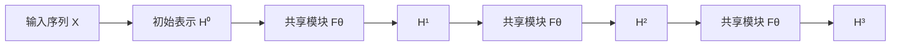

# Recurrent Depth（深度递归）

> [!abstract] 一句话概括
> Recurrent depth 是让同一组网络层沿**计算深度**重复运行，用共享参数反复更新隐藏表示。它在数学形式上很像 RNN，可以理解为一种“沿深度展开的 RNN”。

## 与普通 Transformer 的区别

普通 Transformer 的不同层通常拥有各自的参数：

$$
h_{l+1}=F_{\theta_l}(h_l)
$$

Recurrent-depth 架构则重复使用同一组参数：

$$
H^{(k+1)}=F_{\theta}(H^{(k)}, X)
$$

其中 $k$ 表示计算迭代次数。每次迭代都在上一轮隐藏表示的基础上继续加工；典型实现里的 $F_\theta$ 仍然可以是包含 self-attention 和 FFN 的 Transformer block。

图里的三个 `Fθ` 是同一组参数，而不是三个独立的层。

## 为什么它像 RNN

两者都是把一个隐藏状态反复交给共享参数的更新函数，但循环发生的方向不同：

| 架构 | 循环方向 | 每一步处理的对象 | 状态含义 |
| --- | --- | --- | --- |
| 传统 RNN | 时间 / token 方向 | 下一个 token $x_t$ | 截至当前位置的序列状态 $h_t$ |
| Recurrent-depth Transformer | 网络深度方向 | 通常是整段序列表示 $H^{(k)}$ | 第 $k$ 轮加工后的表示 |

传统 RNN 可以写成：

$$
h_t=F_\theta(h_{t-1}, x_t)
$$

所以 recurrent depth 可以被准确地称为 **depth-wise recurrence（深度方向递归）**：RNN 的“时间步”被替换成了“计算步”。如果每个计算步内部使用 self-attention，同一轮中所有 token 仍可彼此交互，这一点又保留了 Transformer 的特点。

## 它带来的能力与代价

- **参数复用**：增加计算深度时，不必为每一步都增加一套新参数。
- **迭代修正**：隐藏表示可以经过多轮加工，类似在连续表示空间里反复求解。
- **计算量可调的可能性**：若训练方法支持不同迭代次数，可以给困难输入更多计算步；不能仅凭结构假定模型可以无限增加步数。
- **推理成本仍会增加**：共享参数减少的是模型参数量，不会消除每轮计算；循环 $K$ 次仍要执行 $K$ 次模块。
- **训练更困难**：重复更新可能出现不稳定、收敛困难、收益递减，以及训练迭代数之外的泛化问题。

## 容易混淆的三个概念

1. **自回归生成**是在 token 方向逐个生成输出；recurrent depth 是对隐藏表示增加计算迭代。
2. **Reasoning tokens / reasoning effort** 是模型产品和接口层面的推理机制，不能据此反推出底层采用 recurrent depth。
3. **Agent loop** 是模型外部反复调用工具、读取结果再继续行动的软件循环，也不是网络内部的深度递归。

此外，[[MLSys/算子/Linear Attention#3. RNN 形态：推理时只维护一个固定大小的记忆|Linear Attention 的 RNN 形态]]是在**序列方向**维护递推状态，和这里讨论的深度方向递归属于不同概念。

## GPT-6 Astra 是否使用 recurrent depth

> [!warning] 尚无官方架构确认
> 截至 2026-09-08，OpenAI 的 GPT-6 Astra 模型页只公开了 reasoning token 支持和 `low`、`medium`、`high`、`xhigh`、`max` 五档 `reasoning.effort`，没有披露其内部是否采用 recurrent-depth 架构。因此不能从“推理更久”或 reasoning effort 的存在推导出 Astra 使用了 recurrent depth。

## 参考

- [OpenAI API — GPT-6 Astra](https://developers.openai.com/api/docs/models/gpt-6-astra) —— 官方公开能力与 `reasoning.effort` 档位；未披露网络架构

