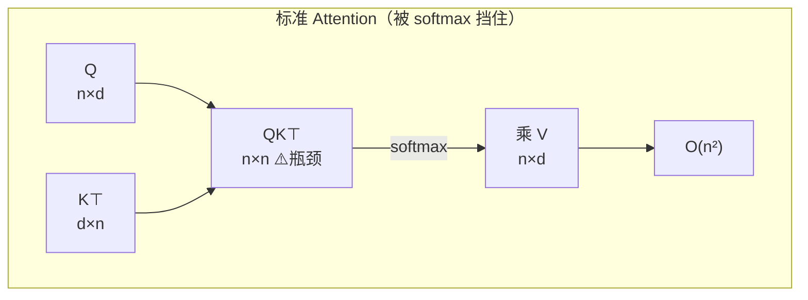
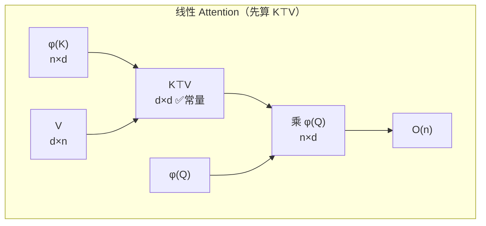
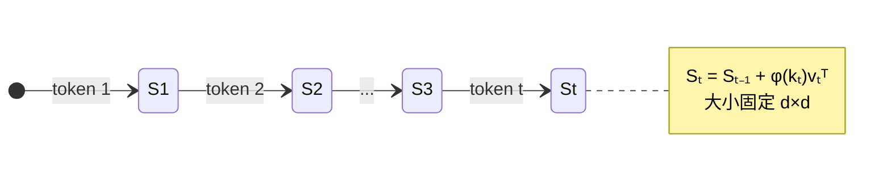
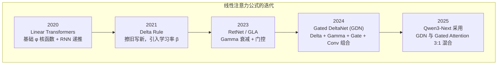
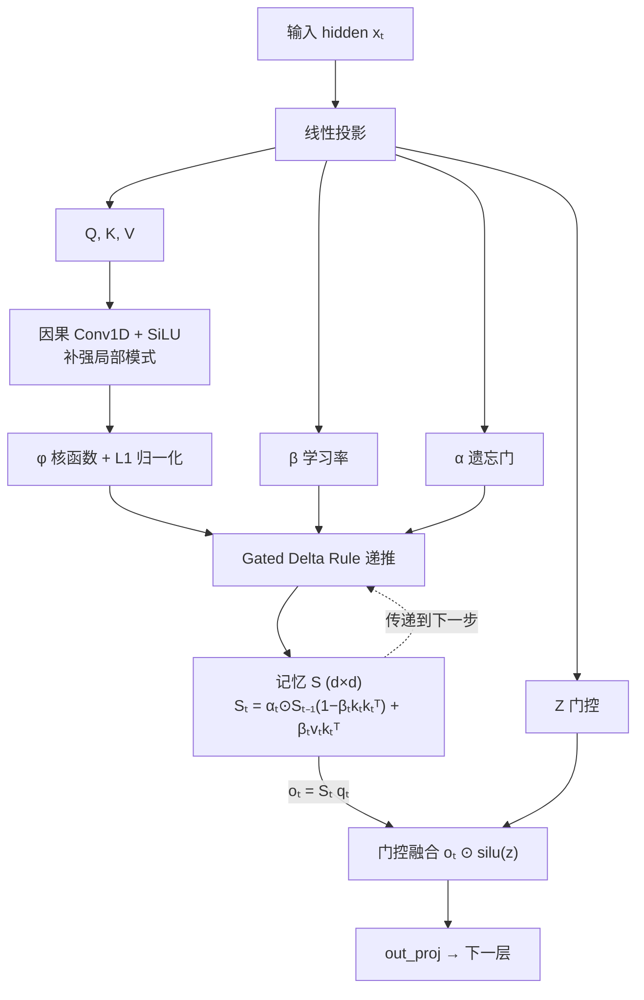
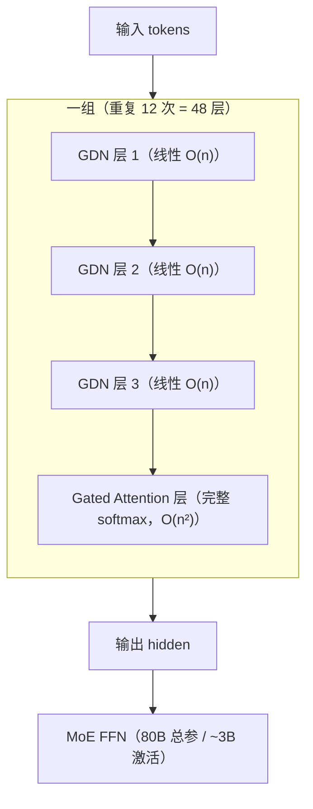

# Qwen 模型中的 Linear Attention 详解

> [!abstract] 一句话概括
> Qwen 里的 **Linear Attention（线性注意力）**，核心是把标准注意力中让计算量随文本长度**平方增长**的 softmax 换掉，改用可以"拆开"的核函数 $\phi$，利用矩阵乘法结合律把复杂度从 $O(n^2)$ 降到 $O(n)$。Qwen3-Next / Qwen3.5 实际使用的是增强版 **Gated DeltaNet (GDN)**，并与标准注意力按 **3:1 混合**，同时拿到"长文本快"和"全局精度高"两个好处。

---

## 目录

- [[#1. 标准注意力为什么慢|1. 标准注意力为什么慢]]
- [[#2. 核函数 φ：把 softmax 拆开的钥匙|2. 核函数 φ：把 softmax 拆开的钥匙]]
- [[#3. RNN 形态：推理时只维护一个固定大小的记忆|3. RNN 形态：推理时只维护一个固定大小的记忆]]
- [[#4. 朴素线性注意力的问题|4. 朴素线性注意力的问题]]
- [[#5. Gated DeltaNet：Qwen 的三个补丁|5. Gated DeltaNet：Qwen 的三个补丁]]
- [[#6. 混合架构：3 层 GDN + 1 层 Gated Attention|6. 混合架构：3 层 GDN + 1 层 Gated Attention]]
- [[#7. 关键结论速查|7. 关键结论速查]]
- [[#8. 延伸阅读|8. 延伸阅读]]

---

## 1. 标准注意力为什么慢

标准 Self-Attention 的公式：

$$O = \text{softmax}(QK^\top)V$$

关键在于 **softmax 作用在 $QK^\top$ 这个 $n \times n$ 的矩阵上**。必须先算出"每个 token 和所有 token 的相关性分数"，再乘 V。中间注意力矩阵大小是 $n \times n$，计算量和显存都是 $O(n^2)$。

> [!tip] 被 softmax 挡住的矩阵结合律
> 如果没有 softmax，公式是 $(QK^\top)V$，根据矩阵乘法结合律，可以改算成 $Q(K^\top V)$——后者中间结果是 $d \times d$（$d$ 是 head 维度，通常 128 左右），与序列长度 $n$ 无关，复杂度变成 $O(n)$。
>
> **但 softmax 不让你这么做**：$\text{softmax}(QK^\top) \neq \text{softmax}(Q) \cdot K^\top$。softmax 横跨整行做归一化，把 Q 和 K 死死"粘"在一起，KV 没法先算。

### 1.1 两种计算顺序对比

| 维度        | 标准 Attention | 线性 Attention              |
| --------- | ------------ | ------------------------- |
| 中间矩阵      | $n \times n$ | $d \times d$（与 n 无关）      |
| 计算复杂度     | $O(n^2)$     | $O(n)$                    |
| 显存复杂度     | $O(n^2)$     | $O(n)$（训练）/ $O(1)$ 增量（推理） |
| 能否 RNN 递推 | ❌            | ✅                         |

---

## 2. 核函数 φ：把 softmax 拆开的钥匙

Linear Attention 的做法：不再用 $\exp(q \cdot k)$ 当相似度，而是选一个可以写成**内积分解**形式的核函数 $\phi$：

$$\text{sim}(q_i, k_j) = \phi(q_i) \cdot \phi(k_j)$$

只要 $\phi$ 满足这个性质，就能把求和拆开：

$$\sum_j \phi(q_i)\phi(k_j)v_j = \phi(q_i) \sum_j \phi(k_j)v_j$$

后面那个求和就是 $K^\top V$，可以预先算好。

> [!note] 核函数的选择
> 为了让注意力权重非负（$\phi(q_i)\phi(k_j) \geq 0$），$\phi$ 一般用：
> - `elu(x) + 1`
> - `relu(x) + 1`
> - `swish` / `silu`
>
> "核函数"这个概念跟 SVM 里的一样：把输入映射到另一个空间，让原本不好算的相似度变成可分解的内积。

### 2.1 朴素线性注意力公式

$$S_t = S_{t-1} + \phi(k_t) v_t^\top$$

$$z_t = z_{t-1} + \phi(k_t)$$

$$o_t = \frac{S_t \, \phi(q_t)}{z_t \, \phi(q_t)}$$

其中：
- $S_t$ 是一个 $d_k \times d_v$ 的"记忆矩阵"
- $z_t$ 是归一化项（normalizer memory）
- 分母保证输出的尺度稳定

---

## 3. RNN 形态：推理时只维护一个固定大小的记忆

上面的公式天然是**递推**形式：每来一个新 token $t$，只需要把 $\phi(k_t)v_t^\top$ 加进 $S$，然后用 $\phi(q_t)$ 去查 $S$。这跟 RNN 的隐状态 $h_t = f(h_{t-1}, x_t)$ 本质一样。

> [!important] 训练 vs 推理的两种形态
> - **训练时**：可以并行计算整个序列（线性算子可分块并行，即 chunk parallel）。
> - **推理时**：每生成一个 token，只维护固定大小的 $d \times d$ 状态 $S$，而不是标准注意力里随序列增长的 KV Cache。
>
> 这意味着长上下文推理时**显存不随长度爆炸**，每步计算量近似 $O(1)$。

### 3.1 KV Cache vs 记忆矩阵 S

| 对比项 | 标准 Attention | 线性 Attention |
|---|---|---|
| 推理时存储 | KV Cache，随 $n$ 增长 | 记忆矩阵 $S$，固定 $d \times d$ |
| 每步计算 | 要和全部历史 $k$ 做内积，$O(n)$ | 查一次 $S$，$O(d^2)$ |
| 长文本显存 | 持续增长，可能 OOM | 恒定 |
| 历史访问方式 | 精确回看每个 token | 压缩汇总（有损） |

---

## 4. 朴素线性注意力的问题

朴素线性注意力虽然快，但**精度比标准注意力差一截**，主要两个问题：

> [!warning] 问题一：记忆容量有限
> $S$ 是 $d \times d$ 矩阵，能存的"正交 key 关联"数量有上限（实验显示约等于 $d_{dot}$，例如 64）。当序列长度超过这个值，新写入的信息会把旧信息"挤掉"或混淆，loss 会明显上升，而 softmax attention 相对稳定。

> [!warning] 问题二：没有遗忘机制
> 只会不断做 $S \mathrel{+}= \phi(k)v^\top$，旧值不会被更新或擦除。随着序列变长，记忆会"糊成一团"，无法覆盖同一个 key 的新 value。

这两个问题催生了一系列增强：Delta Rule、Gamma 遗忘、门控、卷积……最终演进出 Qwen 使用的 Gated DeltaNet。

---

## 5. Gated DeltaNet：Qwen 的三个补丁

Qwen3-Next / Qwen3.5 采用的 **Gated DeltaNet (GDN)** 在递推框架上打了三个关键补丁。

### 5.1 补丁一：Delta Rule（增量更新）

不再无脑累加，而是先"擦掉旧值"再"写入新值"，类似可学习的关联记忆：

$$S_t = S_{t-1}(I - \beta_t k_t k_t^\top) + \beta_t v_t k_t^\top$$

- $\beta_t$ 是由输入生成的**学习率**（代码里叫 `beta`），控制这一步写多重。
- 第一项 $S_{t-1}(I - \beta_t k_t k_t^\top)$ 是"擦除"：把 $k_t$ 方向上的旧分量去掉。
- 第二项 $\beta_t v_t k_t^\top$ 是"写入"：把新的 $v_t$ 写到 $k_t$ 方向。

这让 $S$ 能像字典一样"更新同一个 key 对应的 value"，而不是无限叠加。

> [!note] 工程细节：DPLR
> 公式里用到了 DPLR（Diagonal-Plus-Low-Rank）分解，和 S4 模型里的技巧相同，用来降低存储/运算成本。

### 5.2 补丁二：Gamma 遗忘门（α）

引入跟输入相关的衰减系数 $\alpha_t$，让旧记忆按比例衰减：

$$S_t = \alpha_t \odot S_{t-1} + \text{(Delta 更新项)}$$

- $\alpha_t$ **不是固定常数**，而是数据相关的。
- 在代码里由 `A_log`、`dt_bias` 等参数经过离散化生成。
- 模型能学会"什么该忘、什么该留"。

### 5.3 补丁三：Gate 门控 + 因果卷积

**输出门控 z**：输出端加一个类似 Mamba / GLU 的门控分支，控制哪些信息透传给下一层：

$$o_t = S_t \phi(q_t) \odot \text{silu}(z_t)$$

**因果 1D 卷积**：Q/K/V 在进入递推之前先过一个短卷积（kernel size 通常为 4），补强局部模式建模。

> [!tip] 为什么要加卷积？
> Attention 擅长长距离依赖，但对**邻近 token 的局部结构反而不敏感**。卷积正好互补：
> - 提取局部 n-gram 模式、固定短语
> - 具备平移不变性
> - 增量推理时只需维护一个长度为 kernel_size 的 conv_state，每步 $O(1)$
> - 比注意力便宜得多

### 5.4 L1 归一化消掉 z

通过对 $k$ 和 $q$ 做 L1 归一化：

$$k_t = \frac{\phi(W_K x_t)}{\|\phi(W_K x_t)\|_1}, \quad q_t = \frac{\phi(W_Q x_t)}{\|\phi(W_Q x_t)\|_1}$$

原来递推式里的归一化项 $z_t$ 被消掉，输出简化为：

$$o_t = S_t \phi(q_t)$$

公式更干净，数值更稳定。

### 5.5 GDN 完整数据流

> [!example] 代码里的六个投影量
> 在 HuggingFace 的 `Qwen3NextGatedDeltaNet` 实现中，输入被投影为：
> - `Q, K, V`：查询、键、值
> - `Z`：输出门控
> - `β (beta)`：Delta 规则学习率
> - `α (alpha)`：Gamma 遗忘系数
>
> 加上卷积状态 `conv_state` 和递推状态 `recurrent_state` 两个缓存。

---

## 6. 混合架构：3 层 GDN + 1 层 Gated Attention

纯线性注意力有一个根本短板：记忆 $S$ 是对历史的**压缩汇总**，做不到标准 softmax 注意力那种"对全序列每个位置做精确 pairwise 比较"。在需要**精确全局检索 / 复制**的任务（从长文档抠名字、代码补全匹配标识符）上会吃亏。

所以 Qwen3-Next 采用了务实的混合设计：

> [!success] 分工
> - **3/4 的层用 GDN**：高效处理长上下文，负责"记住和概括"历史，复杂度 $O(n)$。
> - **1/4 的层保留 Gated Softmax Attention**：负责精准全局对齐和信息检索，保证模型不会"失忆"或"找不准"。

### 6.1 关键规格

| 项目 | 数值 |
|---|---|
| 总层数 | 48 |
| GDN 层数 | 36（75%） |
| Gated Attention 层数 | 12（25%） |
| 混合比例 | 3:1 |
| 原生上下文长度 | 262K tokens |
| 理论可扩展 | ~1M tokens |
| 总参数量 | 80B |
| 每 token 激活参数 | ~3B（MoE） |

### 6.2 为什么这个比例有效

> [!quote] 通义团队的发现
> 单纯使用线性注意力或标准注意力都不是最优：
> - 纯线性注意力长文本效率高但精度受损；
> - 纯标准注意力精度高但长文本成本爆炸。
>
> 3:1 的混合让大部分层享受线性复杂度的速度和显存优势，少数层保证精确检索能力，最终在效率和效果之间取得平衡。

---

## 7. 关键结论速查

> [!abstract] 一页纸总结
> **Qwen 里的 Linear Attention = 去掉 softmax → 用核函数 φ 拆开相似度 → 利用矩阵结合律把复杂度从 O(n²) 降到 O(n) → 改写成 RNN 递推，推理时只维护固定大小的记忆矩阵 S；再用 Delta Rule（擦旧写新）、Gamma 遗忘门（数据相关衰减）、因果卷积（补局部建模）和输出门控把精度补回来，这就是 Gated DeltaNet。最后和标准 Gated Attention 按 3:1 混合，既快又准。**

### 7.1 核心数字

- 复杂度：$O(n^2) \to O(n)$
- 推理状态：从随 $n$ 增长的 KV Cache → 固定 $d \times d$ 记忆矩阵 $S$
- Qwen 实现：**Gated DeltaNet (GDN)**
- 混合比例：**3 层 GDN + 1 层 Gated Attention，重复 12 组**
- 上下文：**262K 原生，~1M 理论上限**
- 参数：**80B 总 / 3B 激活**（配合 MoE）

### 7.2 核心公式

GDN 递推：

$$\boxed{S_t = \alpha_t \odot S_{t-1}(I - \beta_t k_t k_t^\top) + \beta_t v_t k_t^\top}$$

$$o_t = S_t \, q_t$$

其中 $k_t, q_t$ 经过 $\phi$ 核函数 + L1 归一化，$\alpha_t$ 是遗忘门，$\beta_t$ 是写入学习率。

---

## 8. 延伸阅读

### 8.1 论文线索

- **Transformers are RNNs** (2020)：首次提出线性注意力的核函数分解与 RNN 等价形式。
- **Linear Transformers Are Secretly Fast Weight Programmers**：揭示线性注意力的记忆容量上限问题，引入 Delta Rule。
- **Retentive Network (RetNet)**：引入 Gamma 衰减，线性注意力的重要里程碑。
- **Gated Delta Networks: Improving Mamba for Long Context**：GDN 的原始论文。
- **Gated Attention**（Qwen 团队，NeurIPS 2025）：标准注意力侧的门控改进。

### 8.2 代码线索

- HuggingFace `transformers`：`src/transformers/models/qwen3_next/modeling_qwen3_next.py`
  - 类 `Qwen3NextGatedDeltaNet`
  - 关键算子：
    - `causal_conv1d_fn` / `causal_conv1d_update`：因果卷积（训练/推理）
    - `chunk_gated_delta_rule`：分块并行递推（训练）
    - `fused_recurrent_gated_delta_rule`：融合递推（推理）
- **flash-linear-attention (FLA)** 库：Triton/CUDA 高性能算子实现。
- **causal-conv1d** 库：Dao-AILab 的因果卷积 CUDA 实现。

### 8.3 相关概念

- [[State Space Model (SSM)]]：GDN 的理论基础之一，HiPPO → S4 → Mamba 脉络。
- [[Mamba]]：SSM 在 LLM 中的代表性应用，GDN 借鉴了其门控与卷积设计。
- [[MoE 混合专家模型]]：Qwen3-Next 在注意力之外的另一大效率支柱。
- [[KV Cache]]：标准注意力推理时的显存瓶颈，线性注意力要解决的核心问题。
- [[RetNet]]：线性注意力路线上的关键前驱。

---

> [!info] 文档信息
> - **整理时间**：2026-08-06
> - **适用模型**：Qwen3-Next（80B-A3B）、Qwen3.5 系列
> - **说明**：本文为技术原理整理，公式与架构基于公开技术博客与 HuggingFace 源码，具体实现以官方代码为准。
