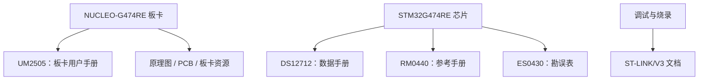

# STM32G474RE 与 NUCLEO-G474RE 文档索引

> [!info]
> 当前电脑已识别到板载 **ST-LINK/V3**（序列号：`003800403235510837333439`）及虚拟串口 `/dev/cu.usbmodem11403`。项目的目标 MCU 是 **STM32G474RE**。若板上丝印为 `NUCLEO-G474RE`，以下板卡资料可直接使用；ST-LINK/V3 本身不能唯一确定板型。

## 文档地图

## 推荐阅读顺序

1. **UM2505**：先确认板子上的 LED、按键、供电跳线、Arduino/Morpho 排针及板载调试器。
2. **DS12712**：查芯片引脚复用、封装、电气参数和外设数量。
3. **RM0440**：真正编程时查 RCC、GPIO、USART、ADC、DMA、定时器等寄存器说明。
4. **ES0430**：调试异常或设计定型前，检查该系列的已知硬件限制。
5. **ST-LINK 文档**：解决下载、调试、虚拟串口或固件升级问题。

## 官方资料

### 板卡

- [NUCLEO-G474RE 产品页](https://www.st.com/en/evaluation-tools/nucleo-g474re.html)
  - 板卡资源总入口；可下载用户手册、原理图、PCB 资料、示例和软件。
- [UM2505 — STM32G4 Nucleo-64 boards (MB1367) 用户手册](https://www.st.com/resource/en/user_manual/um2505-stm32g4-nucleo64-boards-mb1367-stmicroelectronics.pdf)
  - LED/按键、跳线、电源、排针、板载 ST-LINK 的硬件配置。

### MCU

- [STM32G474RE 产品页](https://www.st.com/en/microcontrollers-microprocessors/stm32g474re.html)
  - 该具体芯片的资料与下载入口。
- [DS12712 — STM32G474 数据手册](https://www.st.com/resource/en/datasheet/stm32g474re.pdf)
  - 引脚定义与复用、电气特性、封装、存储器及外设规格。
- [RM0440 — STM32G4 系列参考手册](https://www.st.com/resource/en/reference_manual/rm0440-stm32g4-series-advanced-armbased-32bit-mcus-stmicroelectronics.pdf)
  - 外设寄存器的权威说明：时钟、GPIO、USART、ADC、DMA、定时器等。
- [ES0430 — STM32G471/473/474/483/484 勘误表](https://www.st.com/resource/en/errata_sheet/es0430-stm32g471xx473xx474xx483xx484xx-device-errata-stmicroelectronics.pdf)
  - 芯片已知限制与软件/硬件规避方案。

### 调试与烧录

- [STM32 硬件调试器与烧录器文档](https://www.st.com/en/development-tools/hardware-debugger-and-programmer-tools-for-stm32/documentation.html)
- [TN1235 — ST-LINK 各衍生型号概览](https://www.st.com/resource/en/technical_note/tn1235-overview-of-stlink-derivatives-stmicroelectronics.pdf)
- [STM32CubeProgrammer](https://www.st.com/en/development-tools/stm32cubeprog.html)
  - 独立烧录、擦除、查看目标芯片信息和升级 ST-LINK 固件。

## 实践入口

- 第一个 GPIO/LED 实验：在 UM2505 查 LED 所在引脚，再在 DS12712 确认该脚的 GPIO 端口，最后在 RM0440 依次配置 RCC 和 GPIO。
- 串口日志：macOS 已出现 `/dev/cu.usbmodem11403`；需要在工程中初始化 USART，并在 `__io_putchar()` 中发送单个字节，才能让 `printf` 输出到串口。
- 在 STM32CubeIDE 使用 **Debug Configurations → Debugger → ST-LINK** 连接、下载和断点调试。

