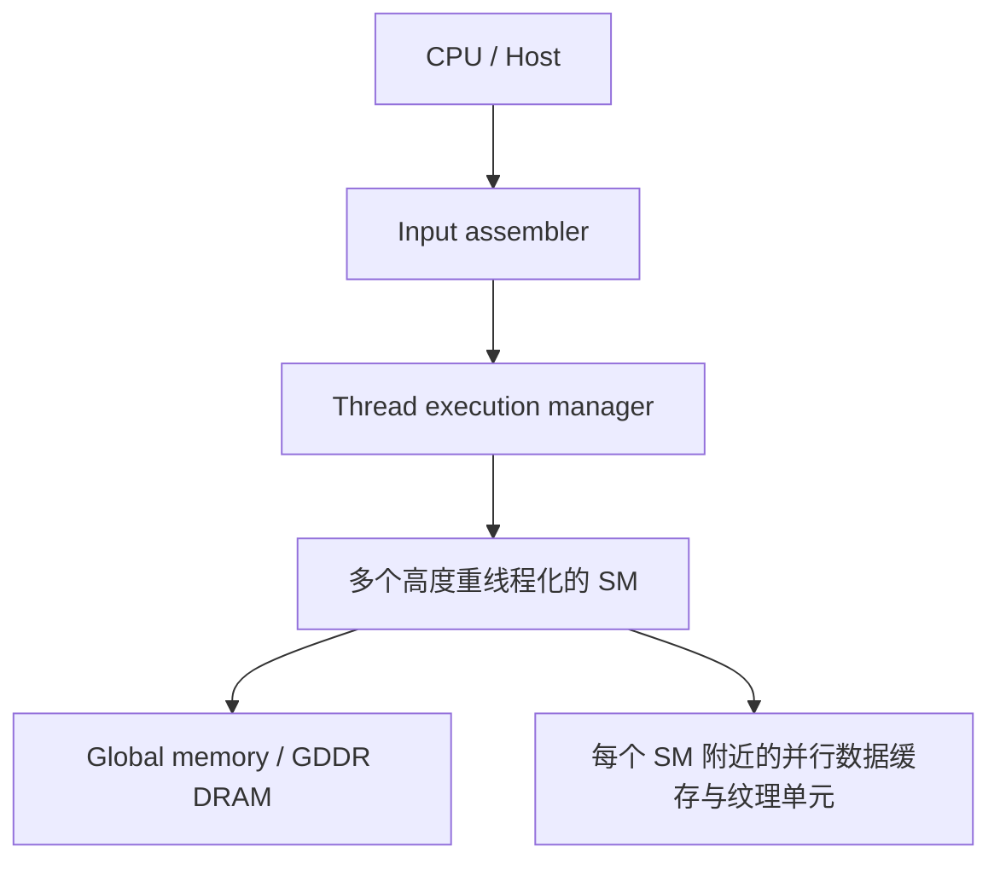

# Programming Massively Parallel Processors —— Chapter 1 Introduction

> [!abstract] 本章主旨
> 单核 CPU 依靠提高单线程性能的时代已经放缓，未来的性能增长主要来自并行执行。GPU 以大量简单、重线程化的计算单元换取吞吐量，适合数据并行的数值密集型工作；真正高性能的程序需要让 CPU 与 GPU 分工协作，并同时处理并行度、数据搬运、内存带宽和可扩展性问题。

## 1. 本章回答的几个问题

1. 为什么软件不能继续只依赖新一代 CPU 自动变快？
2. GPU 的硬件组织为什么适合大规模并行？
3. 什么样的程序适合 GPU，怎样估算潜在加速比？
4. CUDA 与 MPI、OpenMP、OpenCL 的定位有什么不同？
5. 学习 GPU 编程时，除了“把代码并行化”，还需要掌握什么？

## 2. 从提高频率转向并行化

2003 年前后，继续提高 CPU 时钟频率受到功耗和散热的限制；单个时钟周期内增加更多有效工作也越来越困难。于是处理器设计大体分成两条路线：

| 路线 | 主要目标 | 典型设计 | 擅长的工作 |
| --- | --- | --- | --- |
| CPU multicore | 保持较强的单线程性能 | 少量复杂核心、乱序执行、多发射、大缓存和复杂控制逻辑 | 分支多、依赖复杂、顺序性强的代码 |
| GPU many-core | 提高并行程序吞吐量 | 大量相对简单的核心、重线程化、较少控制逻辑、较高内存带宽 | 大量数据上执行相同或相似操作 |

因此，GPU 的优势不是“任何程序都比 CPU 快”，而是把芯片面积和功耗更多投入到算术单元，用大量可切换的线程隐藏内存访问延迟。CPU 则把更多资源投入到降低单线程延迟和处理复杂控制流。

> [!important] 核心判断
> GPU 与 CPU 是不同目标下的设计结果。典型应用应把难以并行、控制复杂的部分交给 CPU，把占运行时间大头且具有数据并行性的数值计算部分交给 GPU。

## 3. 为什么 GPU 能提供高吞吐量

### 3.1 CPU 与 GPU 的资源取舍

- CPU 的乱序执行、分支预测、复杂控制逻辑和大缓存，主要服务于单线程延迟；这些资源本身不直接产生更多浮点运算。
- GPU 用大量线程寻找“当前可执行的工作”：某些线程等待长延迟内存访问时，硬件切换到其他线程，从而减少对复杂控制逻辑的依赖。
- GPU 通常提供更高的显存带宽；代价是显存访问延迟可能更高，因此必须依靠足够的并行线程和合适的访问模式来隐藏延迟。
- 早期 GPU 的通用计算能力、浮点标准支持和编程接口都有限；CUDA 的出现使 GPU 可以脱离图形 API，使用接近 C/C++ 的通用并行编程方式。

### 3.2 典型 CUDA GPU 的组织方式

本章用当时的 CUDA-capable GPU 解释基本结构。具体代际会变化，但抽象关系仍然值得记住：



- **SM（Streaming Multiprocessor）**：GPU 的主要线程执行单元集合。
- **SP（Streaming Processor）**：SM 内的算术执行单元；多个 SP 共享控制逻辑和指令缓存。
- **Global memory**：GPU 上的片外显存，容量较大、带宽高，但访问延迟相对较高。
- **片上存储**：容量小但速度快，用来减少对 global memory 的访问；后续章节会系统讨论不同类型的 CUDA memory。
- **线程数量**：GPU 硬件支持的同时驻留线程数量远多于 CPU 的硬件线程数。大量线程不仅意味着更多并行工作，也意味着更好的延迟隐藏能力。

这里的图和数字是书中 2009 年代 G80/GT200 的历史模型，不能直接当作现代 GPU 的规格表；应保留的是“许多 SM + 每个 SM 的大量线程 + 高带宽显存 + 片上数据复用”这一结构性认识。

### 3.3 SP 与 warp 的关系

这两个概念处在不同层次：

| 概念     | 所在层次    | 含义                                                 |
| ------ | ------- | -------------------------------------------------- |
| Thread | 编程模型    | 一个逻辑执行实例，有自己的寄存器、程序计数器和局部状态                        |
| Warp   | 执行/调度模型 | 通常由 32 个线程组成，是 SM 选择和调度的基本单位；每个线程在 warp 中对应一个 lane |
| SP     | 硬件执行资源  | 执行标量算术指令的处理单元；现代 NVIDIA 文档中通常称为 CUDA Core          |

因此，**SP 不是一个线程，warp 也不是一个 SP**。更准确的执行关系是：

```text
Thread Block
  └── 多个 Warp（每个通常 32 个 Thread）
        └── SM 调度一个就绪 Warp
              └── 由若干 SP/CUDA Core 执行各个 lane 的指令
```

以书中 G80/GT200 的简化模型为例：一个 SM 有 8 个 SP，而一个 warp 有 32 个线程。一个 warp 的指令需要由这些执行资源分批或流水处理，不能理解为“一个线程永久绑定一个 SP”。当某个 warp 因为 global memory 等长延迟操作暂时无法继续时，SM 会调度另一个就绪 warp，让 SP 保持忙碌，这就是 **latency hiding**。

如果只讨论普通标量算术，可以近似地说：一个 SP 在一个执行时隙处理一个 lane 的一次标量操作；但这不是线程与 SP 的固定一一映射。线程状态保存在寄存器文件等存储资源中，SP 会在不同 warp、不同线程之间被复用。

> [!note] 与 SIMT 的联系
> CUDA 让程序员以“每个线程独立执行”的方式编程，但硬件通常以 warp 为单位执行相同指令。遇到分支发散时，同一个 warp 中不同路径会被分时执行，部分 lane 可能暂时闲置。warp 内 lane 之间的数据交换可参考 [[MLSys/算子/Warp Shuffle]]。

## 4. 为什么还需要更多速度和并行度

更快的计算并不只是让现有程序更快，也会让过去只有超级计算机才能承担的应用进入大众产品，例如：

- 分子生物学中的分子活动模拟：计算模型可以补充显微镜等传统仪器，并扩大可模拟的系统规模和时间跨度。
- HDTV、视频编码、3D 成像与可视化：更高分辨率和视角合成会带来更多像素级计算。
- 更自然的用户界面：高分辨率、3D 视角、语音和计算机视觉都会增加实时计算需求。
- 游戏和物理仿真：从预先安排的场景，发展到根据碰撞、损坏和环境状态实时计算的动态世界。

这些应用通常拥有不同粒度的并行性：数据的不同区域可以同时处理，但在阶段边界仍需要汇总或协调。因此，编程模型必须同时解决两件事：

1. 如何把计算任务映射到大量并行线程；
2. 如何高效地把数据送到这些线程，并在必要时进行同步和合并。

## 5. Amdahl 定律：加速上限由串行部分决定

设程序中可并行部分占运行时间的比例为 $p$，这部分获得的加速比为 $s$，则整体加速比为：

$$
S = \frac{1}{(1-p) + \frac{p}{s}}
$$

关键点是：$p$ 必须按**运行时间**计算，而不是按代码行数计算。

| 可并行运行时间比例 $p$ | 并行部分加速比 $s$ | 整体结果 |
| ---: | ---: | ---: |
| 30% | 100× | 约 1.4×；即使并行部分无限快，整体也最多约 1.43× |
| 99% | 100× | 约 50× |

这解释了 GPU 加速的两个前提：

- 需要把运行时间的大部分集中到可并行的“热点”中；
- 不能只看算术吞吐量，还要处理内存带宽和数据搬运瓶颈。

直接把循环拆给 GPU，常常会很快撞上 DRAM 带宽上限。进一步优化通常需要利用片上存储进行数据复用，减少 global memory 访问；但片上存储容量有限，又会引入新的布局、分块和同步约束。

> [!tip] 一个实用的性能问题清单
> 先问“这部分占总运行时间多少”，再问“它能否数据并行”，最后问“数据是否能以足够低的代价送到计算单元”。不要把 GPU 的峰值 FLOPS 直接当成应用加速比。

## 6. CPU/GPU 异构协作

书中用“桃子”来描述应用：难以并行的顺序部分像桃核，适合由 CPU 处理；容易并行、占用大量运行时间的数值部分像果肉，适合由 GPU 处理。

一个合理的 CPU/GPU 程序通常要完成以下分工：

1. CPU 负责控制流、任务组织和不规则或强依赖的计算。
2. CPU 将待处理数据传给 GPU。
3. GPU 以大量线程执行数据并行 kernel。
4. GPU 将结果返回，CPU 继续处理后续逻辑或发起下一轮计算。

GPU 相对 CPU 的加速比还取决于 CPU 对该任务本来就有多擅长，以及 CPU-GPU 之间的数据传输是否抵消了计算收益。因此，“GPU 计算更快”不等于“把所有代码搬到 GPU 更快”。

## 7. 并行编程模型的定位

| 模型 | 内存/通信抽象 | 优点 | 局限或取舍 |
| --- | --- | --- | --- |
| MPI | 不同节点不共享内存，通过显式消息传递通信 | 可扩展到大型集群，适合分布式科学计算 | 数据分发和通信管理成本高，移植工作量可能很大 |
| OpenMP | CPU 共享内存、多线程 | 编程相对直接，适合共享内存多核 CPU | 线程管理和 cache coherence 等开销限制扩展性 |
| CUDA | GPU 内部支持并行线程和共享数据；CPU-GPU 数据传输由程序管理 | 面向 GPU 吞吐量，线程管理开销低，适合数据并行 | 适用范围不如通用共享内存模型，CPU-GPU 之间的数据搬运需要显式关注 |
| OpenCL | 与 CUDA 类似的并行执行和 runtime API，但强调跨厂商标准化 | 可运行在支持该标准的不同处理器上 | 书写更底层、更繁琐；本书写作时在 NVIDIA 平台上的性能和成熟度不如 CUDA |

CUDA 既不像 MPI 那样把节点之间的通信作为主要抽象，也不像 OpenMP 那样试图覆盖所有共享内存程序。它主要针对“许多线程对大量数据执行相似操作”的场景。CUDA 与 OpenMP/MPI 的一些性能思路是相通的，例如任务划分、数据局部性、通信代价和同步开销。

## 8. 本书的三个总体目标

1. **高性能**：学习如何识别并行机会、设计并行算法、利用硬件特征进行优化。
2. **正确性与可靠性**：并行程序不仅要跑得快，还要可调试、结果可靠、能支持真实用户。
3. **跨代可扩展性**：编程方式应能利用未来更多的并行硬件，而不是只针对某一代芯片的固定细节。

作者强调，达到这些目标不需要先系统学习完整的计算机体系结构，但必须掌握与性能直接相关的硬件知识。GPU 编程的难点不是“启动很多线程”本身，而是理解并行执行、内存层次、数据交付和同步之间的关系。

## 9. 全书路线图

- **第 2 章**：GPU 计算的发展历史，解释当前 CUDA 特征和限制的来源。
- **第 3 章**：CUDA 入门，以矩阵乘法为例，覆盖识别并行部分、分配设备内存、数据传输、kernel、启动线程和取回结果。
- **第 4-7 章**：线程组织与执行、CUDA 各级 memory、性能因素、浮点表示与精度。
- **第 8-9 章**：真实应用案例，从并行化方案选择到代码变换和性能优化。
- **第 10 章**：把 CUDA 经验抽象为问题分解、并行算法策略和计算思维。
- **第 11 章**：从 CUDA 程序员视角学习 OpenCL。
- **第 12 章**：总结并讨论大规模并行处理器的未来趋势。

## 10. 读完本章应该留下的心智模型

```text
硬件趋势：单线程性能增长变慢
        ↓
应用性能增长依赖并行化
        ↓
GPU 用大量线程换吞吐量，用并行隐藏内存延迟
        ↓
先找运行时间占比高、数据并行的热点
        ↓
再处理数据搬运、内存带宽、片上复用和同步
        ↓
CPU 与 GPU 协同，而不是简单替代
```

对后续章节最重要的预告是：GPU 优化的中心问题会从“如何启动线程”逐渐转向“如何让线程持续有用地工作，并尽量减少昂贵的数据移动”。例如，后续会遇到更具体的线程内/线程间数据交换，以及固定执行结构对运行时开销的影响，可联系 [[MLSys/算子/Warp Shuffle]] 和 [[MLSys/CUDA Graph]] 继续阅读。

## 参考来源

- David B. Kirk, Wen-mei W. Hwu, *Programming Massively Parallel Processors: A Hands-on Approach*, Chapter 1, pp. 1-18（PDF 内页码）。
- 本笔记是对第一章的中文整理，书中 G80/GT200 的硬件数字仅作为历史背景保留。
