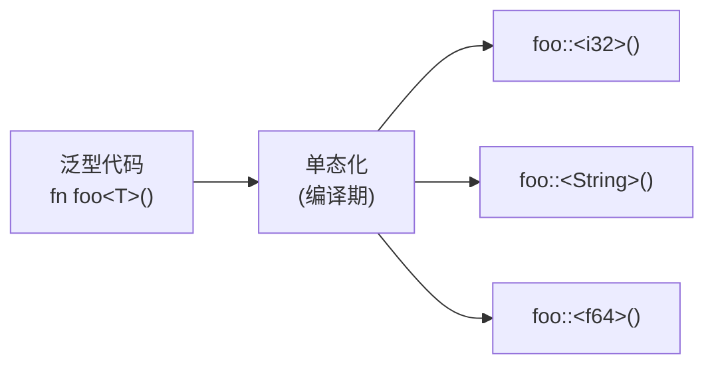

# Rust Generics

> [!summary]
> 泛型是**把具体类型抽象成类型参数**的工具——不是"运行时动态类型"，而是编译期生成多份具体代码的零成本抽象。核心两条线：**如何声明泛型参数**（函数/结构体/枚举/方法）和**编译器的单态化机制**（怎么做到零开销）。trait bound 是泛型的天然搭档，用来约束 T 能做哪些操作，细节见 [[traits|Rust Traits]]。

相关笔记：[[Rust]]、[[Rust Ownership]]、[[traits|Rust Traits]]、[[closure|Rust Closures]]、[[iterators|Rust Iterators]]、[[enum|Enum]]

## 1. 泛型解决什么问题

没有泛型时，为不同类型写相同逻辑只能靠复制粘贴：

```rust
fn largest_i32(list: &[i32]) -> &i32 {
    let mut largest = &list[0];
    for item in list {
        if item > largest {
            largest = item;
        }
    }
    largest
}

fn largest_char(list: &[char]) -> &char {
    let mut largest = &list[0];
    for item in list {
        if item > largest {
            largest = item;
        }
    }
    largest
}
```

两个函数逻辑完全一样，只有类型签名不同。泛型把"类型"变成参数，消除重复：

```rust
fn largest<T>(list: &[T]) -> &T { /* ... */ }
```

## 2. 泛型函数

在函数名后用 `<>` 声明类型参数：

```rust
fn largest<T: std::cmp::PartialOrd>(list: &[T]) -> &T {
    let mut largest = &list[0];
    for item in list {
        if item > largest {
            largest = item;
        }
    }
    largest
}

fn main() {
    let numbers = vec![34, 50, 25, 100, 65];
    let chars = vec!['y', 'm', 'a', 'q'];

    println!("{}", largest(&numbers)); // 100
    println!("{}", largest(&chars));   // y
}
```

要点：
- `T` 只是一个约定俗成的名字（Type），可以是任意标识符。
- `T: PartialOrd` 是 trait bound，告诉编译器"T 必须能比较大小"。没有这个约束，`>` 操作符就没法用。
- 调用时不需要显式指定类型，Rust 会根据实参自动推断（类型推导）。

多个类型参数用逗号分隔：

```rust
fn swap<T, U>(a: T, b: U) -> (U, T) {
    (b, a)
}
```

## 3. 泛型结构体

在 `struct` 名后用 `<>` 声明，字段类型用这些参数：

```rust
struct Point<T> {
    x: T,
    y: T,
}

fn main() {
    let integer_point = Point { x: 5, y: 10 };
    let float_point = Point { x: 1.0, y: 4.0 };
    // let mixed = Point { x: 5, y: 4.0 }; // 错：x 和 y 必须是同一类型
}
```

如果需要 x 和 y 是不同类型，用两个参数：

```rust
struct Point<T, U> {
    x: T,
    y: U,
}

let both_integer = Point { x: 5, y: 10 };
let both_float = Point { x: 1.0, y: 4.0 };
let mixed = Point { x: 5, y: 4.0 }; // OK
```

在标准库中大量使用泛型结构体：

```rust
// Vec<T> — 任意类型的动态数组
let v: Vec<i32> = Vec::new();

// HashMap<K, V> — 任意键值对
use std::collections::HashMap;
let mut scores: HashMap<String, i32> = HashMap::new();
```

## 4. 泛型枚举

标准库中最经典的两个泛型枚举：

```rust
enum Option<T> {
    Some(T),
    None,
}

enum Result<T, E> {
    Ok(T),
    Err(E),
}
```

`Option<T>` 用单个泛型参数表达"可能有值"，`Result<T, E>` 用两个参数分别表达成功和错误的类型。

对比非泛型版本就能看出泛型的价值——不用为每个类型都定义一套 `OptionI32`、`OptionString`、`OptionBool`……

## 5. 泛型方法 / `impl` 块

在 `impl` 后面声明类型参数，表示"为泛型类型的所有变体实现方法"：

```rust
struct Point<T> {
    x: T,
    y: T,
}

impl<T> Point<T> {
    fn x(&self) -> &T {
        &self.x
    }
}
```

注意：`impl<T>` 是必需的——它告诉编译器 `T` 是泛型参数而非具体类型名。

### 为特定类型实现方法

也可以只为某些具体类型实现方法（constrained impl）：

```rust
impl Point<f32> {
    fn distance_from_origin(&self) -> f32 {
        (self.x.powi(2) + self.y.powi(2)).sqrt()
    }
}
```

只有 `Point<f32>` 才能调用 `distance_from_origin`，`Point<i32>` 不行。

### 方法自身的泛型参数

方法可以有自己的泛型参数，和 `impl` 的参数是独立的：

```rust
impl<T, U> Point<T, U> {
    fn mixup<V, W>(self, other: Point<V, W>) -> Point<T, W> {
        Point {
            x: self.x,
            y: other.y,
        }
    }
}

fn main() {
    let p1 = Point { x: 5, y: 10.4 };
    let p2 = Point { x: "Hello", y: 'c' };
    let p3 = p1.mixup(p2); // Point { x: 5, y: 'c' }
}
```

这里 `T, U` 定义在 `impl` 上（结构体的泛型），`V, W` 定义在方法上（方法自己的泛型）。

## 6. Trait Bounds — 约束泛型

泛型给了灵活性，但也带来了限制：在不知道 `T` 是什么类型时，能做的操作非常有限。

```rust
// 不能编译：T 可以是任何类型，不一定支持 >
fn largest<T>(list: &[T]) -> &T {
    let mut largest = &list[0];
    for item in list {
        if item > largest { /* 错：不能对泛型 T 使用 > */ }
    }
    largest
}
```

**Trait bound** 解决这个问题：告诉编译器"T 必须实现某些 trait"，从而解锁相应的操作。

```rust
// T 必须能比较大小
fn largest<T: PartialOrd>(list: &[T]) -> &T { /* ... */ }

// T 必须能比较 AND 能被打印
fn print_largest<T: PartialOrd + std::fmt::Display>(list: &[T]) {
    println!("{}", largest(list));
}
```

多个 trait bound 用 `+` 连接。常见的 bound 有 `Clone`、`Copy`、`Debug`、`Display`、`PartialOrd` 等，完整速查和用 trait bound 条件实现方法的细节见 [[traits|Rust Traits]]。

## 7. `where` 子句

当 trait bound 列表很长时，用 `where` 更可读：

```rust
// 不用 where：拥挤
fn some_function<T: Display + Clone, U: Clone + Debug>(t: &T, u: &U) -> i32 { /* ... */ }

// 用 where：清晰
fn some_function<T, U>(t: &T, u: &U) -> i32
where
    T: Display + Clone,
    U: Clone + Debug,
{
    /* ... */
}
```

`where` 在泛型参数列表之后、函数体之前。当 bound 涉及关联类型时 `where` 更几乎是必需：

```rust
fn process<I>(iter: I)
where
    I: Iterator,
    I::Item: Display,
{
    for item in iter {
        println!("{}", item);
    }
}
```

## 8. 单态化 — 零成本抽象

**单态化**（Monomorphization）是编译器在编译期把泛型代码"展开"成具体类型代码的过程。

```rust
let integer = Some(5);
let float = Some(5.0);
```

编译后，上面代码会变成：

```rust
enum Option_i32 {
    Some(i32),
    None,
}

enum Option_f64 {
    Some(f64),
    None,
}

let integer = Option_i32::Some(5);
let float = Option_f64::Some(5.0);
```

编译器会为每个用到的具体类型生成一份独立代码，因此：

- **无运行时开销**：泛型代码和手写具体类型代码性能一样（零成本抽象）。
- **二进制体积增大**：每种具体类型都会生成一份代码（代码膨胀），但 Rust 会合并相同的单态化结果来缓解。
- **编译时间更长**：编译期要为每个具体类型执行类型检查。

这是 Rust 泛型和 Java/C# 泛型的根本区别——后者在运行时保留类型信息，Rust 在编译期完全消除。



## 9. 常见模式

### 返回泛型类型

```rust
// 返回和输入同类型的值
fn identity<T>(x: T) -> T {
    x
}

// 从输入创建新值
fn make_pair<T>(x: T) -> (T, T) {
    (x, x) // 注意：需要 T: Clone 或 T: Copy
}
```

### blanket implementation — 泛型 trait 实现

Rust 允许为一个泛型类型一次性实现 trait，只要满足条件：

```rust
// 标准库中的 blanket impl：
// "只要实现 Display，就自动实现 ToString"
impl<T: Display> ToString for T {
    /* ... */
}
```

这意味着任何能 `Display` 的类型都能 `.to_string()`，无需手动为每个类型实现。

## 10. 常见坑

### 泛型类型必须是同一类型

```rust
struct Point<T> { x: T, y: T }

let p = Point { x: 5, y: 10 };  // OK
// let p = Point { x: 5, y: 4.0 }; // 错：T 不能同时是 i32 和 f64
```

如果需要不同字段不同类型，用多个泛型参数。

### 不能对裸泛型 T 做类型特定的操作

```rust
fn double<T>(x: T) -> T {
    // x * 2  // 错：T 不一定是数字
}
```

必须加 trait bound，例如 `T: std::ops::Mul<i32, Output = T>`。

### 忘记 `impl<T>` 

```rust
struct Point<T> { x: T, y: T }

// 错：缺少 impl<T>
impl Point<T> {
    fn x(&self) -> &T { &self.x }
}

// 对
impl<T> Point<T> {
    fn x(&self) -> &T { &self.x }
}
```

### 性能误区

泛型的零成本是以编译时间和二进制体积为代价的。在嵌入式或对体积敏感的场合，大量泛型使用可能带来显著代码膨胀。

## 11. 和 C++ 模板的对比

| 维度 | Rust 泛型 | C++ 模板 |
|---|---|---|
| 本质 | trait-bounded generics | duck-typing（编译通过就行）|
| 约束方式 | 显式 trait bound | 隐式要求（C++20 引入 concepts） |
| 错误信息 | 在定义处就能检测到类型不满足约束 | 错误经常出现在实例化点，报错冗长 |
| 单态化 | 是 | 是 |
| 运行时开销 | 无 | 无 |

## 12. 一句话总结

Rust 泛型的核心是**声明类型参数消除重复 + 编译器单态化保证零开销**。泛型不是让代码"运行得更快"——它是让代码"在保持类型安全和零开销的前提下更通用"。与 trait 的关系：泛型定义"参数化的结构"，[[traits|trait]] 定义"参数化结构能做什么"。

## Related
- [[traits|Rust Traits]]
- [[The Rust Programming Language]]
- [[enum|Enum]]
- [[closure|Rust Closures]]
- [[iterators|Rust Iterators]]
