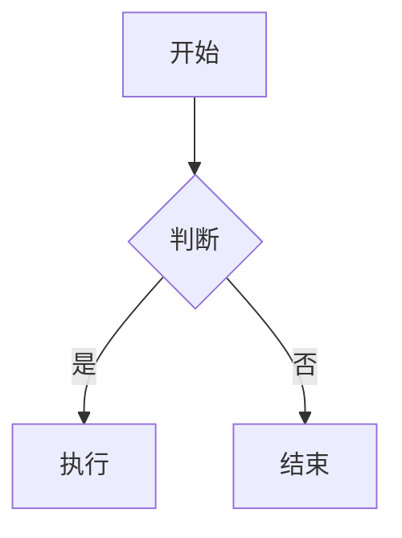

# Mermaid

## Definition

**Mermaid** 是一个基于 JavaScript 的图表绘制工具，允许开发者用类似 Markdown 的文本语法描述图表，并在渲染时转换为 SVG。它特别适合版本控制、文档和协作场景，因为图表源码本身就是纯文本。

## Supported diagram types

| 类型 | 关键字 | 典型用途 |
|------|--------|----------|
| 流程图 | `graph` / `flowchart` | 算法、业务逻辑、决策路径 |
| 时序图 | `sequenceDiagram` | 交互协议、API 调用链 |
| 类图 | `classDiagram` | 面向对象设计、UML |
| 状态图 | `stateDiagram-v2` | 状态机、生命周期 |
| 饼图 | `pie` | 比例展示 |
| 甘特图 | `gantt` | 项目排期 |
| ER 图 | `erDiagram` | 数据库实体关系 |
| 思维导图 | `mindmap` | 层级发散结构 |
| 象限图 | `quadrantChart` | 技术选型、优先级评估 |
| Git 图 | `gitGraph` | 分支与合并历史 |

## Basic syntax

```markdown

```

## Class diagram relationships in C++

| UML 关系 | C++ 典型实现 | 关键特征 |
|----------|--------------|----------|
| 组合（Composition） | 值成员 `Heart heart_` | 成员生命周期绑定宿主 |
| 聚合（Aggregation） | 指针/智能指针 `Employee*` | 指向外部对象，不拥有所有权 |
| 关联（Association） | 双向指针引用 | 彼此认识，独立生命周期 |
| 依赖（Dependency） | 方法参数/局部变量 `void drive(Car&)` | 不持有引用，临时使用 |

## Tips

- 中文节点建议用引号包裹，避免渲染异常。
- Obsidian 原生支持 Mermaid，自动适配亮/暗主题，支持缩放与拖拽。
- 复杂或手绘风格图表可考虑 Excalidraw；在线调试可用 Mermaid Live Editor。

## Quartz integration notes

在 Quartz v5 中使用 Mermaid 时，图表经历了三层转换：

1. Markdown 中的 `mermaid` 代码块
2. Quartz build 生成的 HTML 中 `<code class="mermaid">`
3. 浏览器加载 Mermaid ESM 后调用 `mermaid.run({ nodes })` 替换为 SVG

因此排查问题时应以**浏览器实际渲染**为准，仅跑 Node 端的 `mermaid.parse()` 可能无法复现。

### classDiagram 常见陷阱

- 空 class block 不要写成 `class EmptyClass {}`。
- 自定义 stereotype（如 `<<example>>`）容易触发解析错误。
- 反向虚线实现箭头（`<|..`、`..|>`）不稳定，可用普通依赖箭头加标签替代。
- Python 类型标注、`*args`、`**kwargs`、`tuple[...]`、`| None` 等复杂签名容易触发 parser 边界问题，建议简化。

### Checklist

- [ ] 本地临时安装与页面同版本的 Mermaid 验证。
- [ ] 排查时读取 Markdown 原文，而非已被替换的错误 SVG 的 `innerText`。
- [ ] 用浏览器 `mermaid.run()` 复现，不只看 `parse()`。
- [ ] 抓取完整 `Runtime.exceptionThrown`，定位 `Parse error on line ...`。
- [ ] 验证 `document.querySelectorAll("svg[aria-roledescription=error]").length === 0`。

## Related concepts

- [[concepts/Markdown|Markdown]] — 轻量级标记语言
- [[concepts/Diagram as Code|Diagram as Code]] — 以代码方式描述和版本化图表
- [[concepts/UML|UML]] — 统一建模语言

## Sources

- [[sources/src-mermaid-guide|src-mermaid-guide]]
- [[language/mermaid/Quartz Mermaid 排错手册]]
