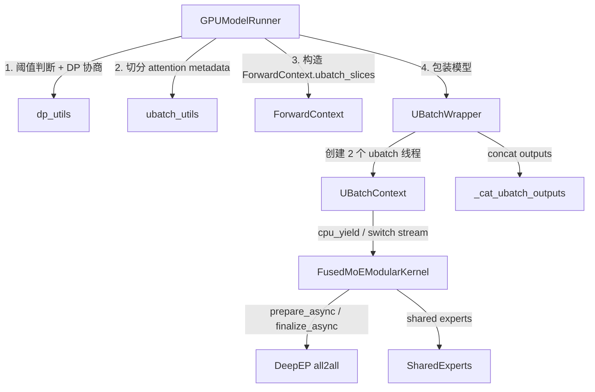
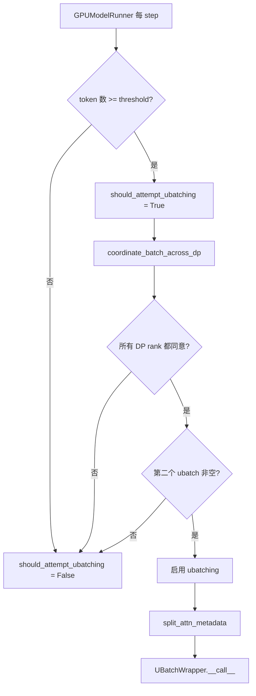
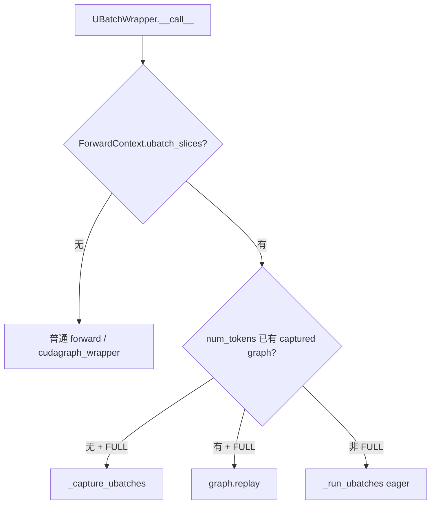
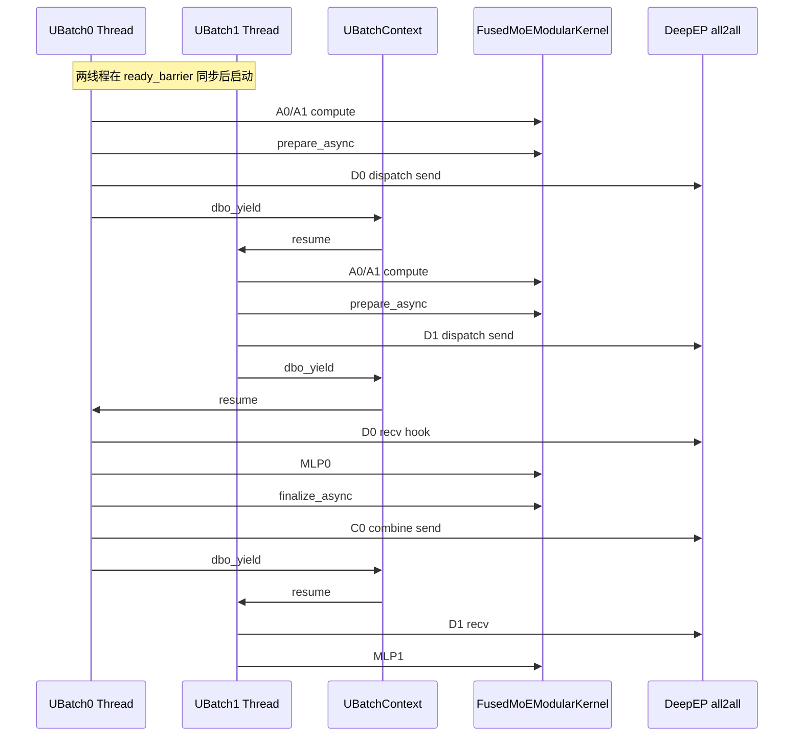

# vLLM DBO 源码梳理

> DBO = **Dual Batch Overlap**，vLLM 中用于在 **DP+EP（数据并行 + 专家并行）** 场景下，把 MoE 层的稀疏 all-to-all 通信与前后计算重叠起来的一种调度机制。

## 0. 一句话定义

把一次 forward 的 batch 切成两个 **microbatch（代码里叫 ubatch / µ-batch）**，启动两个 CPU worker 线程分别跑这两个 ubatch；在 `FusedMoEModularKernel` 里插入 `dbo_yield()` 等让出点，使一个线程在做 compute 时，另一个线程可以等待通信完成，从而实现 **compute/comm ping-pong**。

> [!note]
> 目前 DBO 只支持 **DeepEP** all2all 后端，并且只支持 **Full CUDA Graph**。

## 1. 启用方式与前提

### CLI 参数

| 参数 | 默认值 | 含义 |
|------|--------|------|
| `--enable-dbo` | `False` | 开启 DBO |
| `--data-parallel-size N` | 1 | 必须 `N > 1` |
| `--enable-expert-parallel` | `False` | 必须开启 |
| `--all2all-backend` | - | `deepep_low_latency`（decode 为主）或 `deepep_high_throughput`（prefill 为主） |
| `--dbo-decode-token-threshold` | 32 | 纯 decode batch 启用 DBO 的最小 token 数 |
| `--dbo-prefill-token-threshold` | 512 | 含 prefill batch 启用 DBO 的最小 token 数 |

示例命令（来自设计文档）：

```bash
vllm serve deepseek-ai/DeepSeek-V2-Lite \
  --trust-remote-code \
  --data-parallel-size 2 \
  --enable-expert-parallel \
  --enable-dbo \
  --all2all-backend deepep_low_latency
```

### 配置来源

- `[parallel.py:208-222](vllm/config/parallel.py#L208-L222)`：`enable_dbo`、`dbo_decode_token_threshold`、`dbo_prefill_token_threshold`、`ubatch_size`
- `[parallel.py:522-528](vllm/config/parallel.py#L522-L528)`：`use_ubatching` / `num_ubatches` 属性，`enable_dbo` 时固定为 2
- `[arg_utils.py:492-495, 1097-1111, 2067-2070](vllm/engine/arg_utils.py#L492-L495)`：CLI 到 `ParallelConfig` 的映射
- `[envs.py:246, 1760-1771](vllm/envs.py#L246)`：`VLLM_DBO_COMM_SMS`（默认 20 SM 给通信，其余给计算）
- `[platforms/cpu.py:155-158](vllm/platforms/cpu.py#L155-L158)`：CPU 平台强制关闭 DBO

## 2. 架构总览



## 3. 数据流与控制流

1. **配置阶段**
   - CLI 参数进入 `ParallelConfig`，`use_ubatching` 为真、`num_ubatches = 2`。
   - `[gpu_worker.py:351-352](vllm/v1/worker/gpu_worker.py#L351-L352)` 初始化 2 个 ubatch 的 workspace slot。

2. **每 step 决策**
   - `[gpu_model_runner.py:3896](vllm/v1/worker/gpu_model_runner.py#L3896)` 调用 `[coordinate_batch_across_dp()](vllm/v1/worker/dp_utils.py#L164-L225)`。
   - `coordinate_batch_across_dp` 检查阈值，并通过 `dist.all_reduce` 让所有 DP rank 就 "是否 microbatch" 达成一致。
   - 如果启用 microbatch，会把各 rank 的 token 数 padding 到全局最大值；若某个 rank 的第二个 ubatch 为空，则整体放弃 microbatch。

3. **构造 ubatch_slices**
   - `[gpu_model_runner.py:2501](vllm/v1/worker/gpu_model_runner.py#L2501)` 调用 `[maybe_create_ubatch_slices()](vllm/v1/worker/ubatch_utils.py#L63-L114)` 得到 `UBatchSlice` 列表。
   - 调用 `[split_attn_metadata()](vllm/v1/worker/ubatch_utils.py#L251-L265)` 把 `CommonAttentionMetadata` 按 request/token 边界切成两份。
   - 注意：若请求跨 ubatch 边界，需要调整 `query_start_loc`、`seq_lens` 等字段。

4. **进入 UBatchWrapper**
   - `ForwardContext.ubatch_slices` 被传入，模型在 `[UBatchWrapper.__call__](vllm/v1/worker/gpu_ubatch_wrapper.py#L431-L527)` 中判断启用 DBO。
   - 首次遇到该 `num_tokens` 且 `CUDAGraphMode.FULL` 时走 `_capture_ubatches()`；否则若已有 graph 则直接 `replay()`；否则走 eager `_run_ubatches()`。

5. **线程同步**
   - `[make_ubatch_contexts()](vllm/v1/worker/ubatching.py#L202-L241)` 创建 2 个 `UBatchContext`。
   - 每个 ubatch 线程在 `__enter__` 中等待 `ready_barrier`，然后进入 `cpu_wait_event` 睡眠；主线程唤醒 ubatch0 后开始执行。
   - `dbo_yield()` 让当前线程把 CPU 执行权交给另一个线程，并保证任何时候只有一个线程在 CPU 上推进。

6. **MoE 层重叠**
   - `[FusedMoEModularKernel.forward](vllm/model_executor/layers/fused_moe/modular_kernel.py#L1134-L1203)` 在 `prepare_async` 前后调用 `dbo_maybe_run_recv_hook()` / `dbo_register_recv_hook(hook)` / `dbo_yield()`。
   - `[FusedMoEModularKernel._finalize](vllm/model_executor/layers/fused_moe/modular_kernel.py#L1320-L1352)` 在 `finalize_async` 前后做同样的事。
   - DeepEP HT 后端在 `[deepep_ht.py](vllm/model_executor/layers/fused_moe/prepare_finalize/deepep_ht.py)` 里通过 `dbo_switch_to_compute_sync()`、`dbo_switch_to_compute()`、`dbo_switch_to_comm()` 显式切换 stream。

7. **输出拼接**
   - `[UBatchWrapper._run_ubatches()](vllm/v1/worker/gpu_ubatch_wrapper.py#L295-L331)` 把两个 ubatch 的输出按 batch 维度 `[torch.cat](vllm/v1/worker/gpu_ubatch_wrapper.py#L46-L48)` 起来。

### 3.1 每 step 决策流程



## 4. 关键组件详解

### 4.1 GPUModelRunner — 决策与切分

- `[gpu_model_runner.py:4146-4148](vllm/v1/worker/gpu_model_runner.py#L4146-L4148)`：启用 microbatch 时关闭 cascade attention。
- `[gpu_model_runner.py:487-488](vllm/v1/worker/gpu_model_runner.py#L487-L488)`、`[2501](vllm/v1/worker/gpu_model_runner.py#L2501)`：调用 `maybe_create_ubatch_slices` / `split_attn_metadata`。

### 4.2 UBatchWrapper — 线程 + CUDA Graph 管理

文件：`[vllm/v1/worker/gpu_ubatch_wrapper.py](vllm/v1/worker/gpu_ubatch_wrapper.py)`

- `SMControlContextManager`：通过 `VLLM_DBO_COMM_SMS` 限制通信 kernel 占用的 SM 数，把剩余 SM 给 DeepGEMM 等计算 kernel。
- `_capture_ubatches()`：在 graph capture 期间启动两个线程跑完模型，主线程捕获一个完整 CUDA graph；replay 时无需多线程/CPU 同步。
- `_run_ubatches()`：eager 路径，直接启动两个线程跑模型。
- `_make_ubatch_metadata()`：为每个 ubatch 创建独立的 `ForwardContext`，并构造 `UbatchMetadata`。



### 4.3 UBatchContext — 线程同步原语

文件：`[vllm/v1/worker/ubatching.py](vllm/v1/worker/ubatching.py)`

| 接口 | 作用 |
|------|------|
| `dbo_enabled()` | 当前线程是否在 ubatch 上下文中 |
| `dbo_current_ubatch_id()` | 当前线程属于哪个 ubatch（0/1） |
| `dbo_yield()` | 让出 CPU，唤醒另一个 ubatch 线程 |
| `dbo_switch_to_comm()` / `dbo_switch_to_compute()` | 切换当前 CUDA stream 到通信/计算 stream |
| `dbo_switch_to_comm_sync()` / `dbo_switch_to_compute_sync()` | 切换 stream 并插入 event 同步 |
| `dbo_register_recv_hook(hook)` | 把接收完成的 hook 注册到另一个 ubatch 的上下文 |
| `dbo_maybe_run_recv_hook()` | 执行已注册的 recv hook（通常用于等 all2all） |
| `dbo_get_previous_event()` | 在 ubatch compute stream 上执行回调以记录/等待 event |

实现要点：
- 两个 ubatch 线程共享一个 `comm_stream` 和一个 `compute_stream`。
- 通过 `threading.Barrier` 同步启动，`threading.Event` 做 CPU 线程间睡眠/唤醒。
- 通过 `torch.Event` 做 GPU stream 间同步。


### 4.4 ubatch_utils — 切片工具

文件：`[vllm/v1/worker/ubatch_utils.py](vllm/v1/worker/ubatch_utils.py)`

- `UBatchSlice`：一个 request slice + 一个 token slice。
- `check_ubatch_thresholds()`：按 decode/prefill 判断 token 数是否超过阈值。
- `maybe_create_ubatch_slices()`：根据 token split point 生成 ubatch 切片。
- `split_attn_metadata()`：为每个 ubatch slice 构造独立的 `CommonAttentionMetadata`。

### 4.5 dp_utils — 跨 DP rank 协商

文件：`[vllm/v1/worker/dp_utils.py](vllm/v1/worker/dp_utils.py)`

- `_run_ar()`：用 `dist.all_reduce` 同步 4 维信息：`orig_num_tokens`、`padded_num_tokens`、`should_ubatch`、`cudagraph_mode`。
- `_post_process_ubatch()`：所有 rank 都同意才启用 microbatch，并检查第二个 ubatch 是否为空。
- `_post_process_cudagraph_mode()`：取所有 rank 的 cudagraph mode 最小值，保证一致。
- `_post_process_dp_padding()`：启用 ubatching 或 cudagraph 时，把各 rank padding 到全局最大 token 数。

### 4.6 MoE 层 yield 点

文件：`[vllm/model_executor/layers/fused_moe/modular_kernel.py](vllm/model_executor/layers/fused_moe/modular_kernel.py)`

```text
prepare_async 前:  dbo_maybe_run_recv_hook()      # 处理上一个 ubatch 的 combine recv
prepare_async 中:  hook -> dbo_register_recv_hook(hook)
                   dbo_yield()                    # 让出 CPU，让另一个 ubatch 跑
_finalize 中:      hook -> dbo_register_recv_hook(hook)
                   dbo_yield()                    # 同上
```

`hook` 一般由 `FusedMoEPrepareAndFinalizeModular` 返回，用于等待 all2all 完成。



### 4.7 DeepEP HT 调度实现

文件：`[vllm/model_executor/layers/fused_moe/prepare_finalize/deepep_ht.py](vllm/model_executor/layers/fused_moe/prepare_finalize/deepep_ht.py)`

- dispatch 后调用 `dbo_switch_to_compute_sync()`，让当前 ubatch 回到计算 stream 等 dispatch 完成，同时把 CPU 让给另一个 ubatch。
- combine 前调用 `dbo_yield_and_switch_from_compute_to_comm()`，从计算切换到通信 stream。
- combine 后调用 `dbo_switch_to_compute()` / `dbo_yield_and_switch_from_comm_to_compute()` 切回计算 stream。

## 5. 当前重叠调度示例

来自 `[docs/design/dbo.md](docs/design/dbo.md)`：

```python
# Schedule notation legend:
#    S = Shared expert
#    A0 = MLA qkv proj,
#    A1 = Core attn + out proj + MoE gate
#    D = Dispatch
#    C = Combine

# Comp: |-A0₀-A1₀-||-MLP₁-||-S₁-MLP₀-||-S₀-A0₁-A1₁-|
# Comm: |----D₁---||--D₀--||----C₁---||-----C₀-----|
# Order: D₁ send, A0₀, A1₀, D₁ recv, D₀ send, MLP₁, D₀ recv,
#        C₁ send, S₁, MLP₀, C₁ recv, C₀ send, S₀, A0₁, A1₁, C₀ recv.
# MLP_SHARED_OVERLAP = "mlp_shared_overlap"
```



```mermaid
gantt
    title DBO Overlap Schedule
    dateFormat X
    axisFormat %s

    section UBatch0
    "A0/A1 compute"   :a0, 0, 2
    MLP0              :mlp0, after a0, 2
    Shared0           :s0, after mlp0, 1
    "A0/A1 compute"   :a1, after s0, 2

    section UBatch1
    MLP1              :mlp1, 2, 2
    Shared1           :s1, after mlp1, 1

    section Communication
    D1 dispatch       :d1, 0, 3
    D0 dispatch       :d0, after d1, 2
    C1 combine        :c1, after d0, 3
    C0 combine        :c0, after c1, 5
```

含义：ubatch 0 和 ubatch 1 的 MLA/Attention/MLP 计算与对方的 Dispatch/Combine 通信交替重叠。

## 6. 不支持的场景

- `[platforms/cpu.py:155-158](vllm/platforms/cpu.py#L155-L158)`：CPU 后端强制关闭 DBO。
- `[elastic_execute.py:340](vllm/distributed/elastic_ep/elastic_execute.py#L340)`：Elastic EP 暂不支持 DBO。
- `[extract_hidden_states.py:200-213](vllm/v1/spec_decode/extract_hidden_states.py#L200-L213)`：EAGLE/spec-decode 的 hidden state 提取未实现 DBO。
- `[llm_base_proposer.py:1673-1685](vllm/v1/spec_decode/llm_base_proposer.py#L1673-L1685)`：EAGLE 不支持 ubatching。
- `[config/vllm.py:1444, 2051](vllm/config/vllm.py#L1444)`：async scheduling / spec-decode 等特性组合不支持。
- `[gpu_model_runner.py:4146-4148](vllm/v1/worker/gpu_model_runner.py#L4146-L4148)`：启用 DBO 时关闭 cascade attention。

## 7. 测试

- `[tests/v1/distributed/test_dbo.py](tests/v1/distributed/test_dbo.py)`：DP=2 + EP，用 DeepSeek-V2-Lite 在 GSM8K 上做端到端正确性测试。
- 只在安装了 DeepEP 时运行，`Blackwell` 平台当前 xfail（精度不稳定）。

## 8. 参考文件索引

| 文件 | 说明 |
|------|------|
| `[docs/design/dbo.md](docs/design/dbo.md)` | 官方设计文档 |
| `[vllm/config/parallel.py](vllm/config/parallel.py)` | `enable_dbo`、thresholds、`num_ubatches` |
| `[vllm/engine/arg_utils.py](vllm/engine/arg_utils.py)` | CLI 参数 |
| `[vllm/forward_context.py](vllm/forward_context.py)` | `ForwardContext.ubatch_slices`、`set_forward_context` |
| `[vllm/envs.py](vllm/envs.py)` | `VLLM_DBO_COMM_SMS` |
| `[vllm/v1/worker/gpu_worker.py](vllm/v1/worker/gpu_worker.py)` | workspace 按 `num_ubatches` 初始化 |
| `[vllm/v1/worker/workspace.py](vllm/v1/worker/workspace.py)` | per-ubatch workspace indexing |
| `[vllm/v1/worker/gpu_model_runner.py](vllm/v1/worker/gpu_model_runner.py)` | DBO 主调度器 |
| `[vllm/v1/worker/gpu_ubatch_wrapper.py](vllm/v1/worker/gpu_ubatch_wrapper.py)` | `UBatchWrapper`、线程、CUDA Graph |
| `[vllm/v1/worker/ubatching.py](vllm/v1/worker/ubatching.py)` | `UBatchContext`、同步原语 |
| `[vllm/v1/worker/ubatch_utils.py](vllm/v1/worker/ubatch_utils.py)` | `UBatchSlice`、metadata 切分 |
| `[vllm/v1/worker/dp_utils.py](vllm/v1/worker/dp_utils.py)` | 跨 DP rank 协商 |
| `[vllm/model_executor/layers/fused_moe/modular_kernel.py](vllm/model_executor/layers/fused_moe/modular_kernel.py)` | MoE yield 点 |
| `[vllm/model_executor/layers/fused_moe/prepare_finalize/deepep_ht.py](vllm/model_executor/layers/fused_moe/prepare_finalize/deepep_ht.py)` | DeepEP HT 调度 |
| `[tests/v1/distributed/test_dbo.py](tests/v1/distributed/test_dbo.py)` | 端到端测试 |

# 官方文档
https://github.com/vllm-project/vllm/blob/97995f6376fd3dae7a67624055ddf038233e181e/docs/design/dbo.md