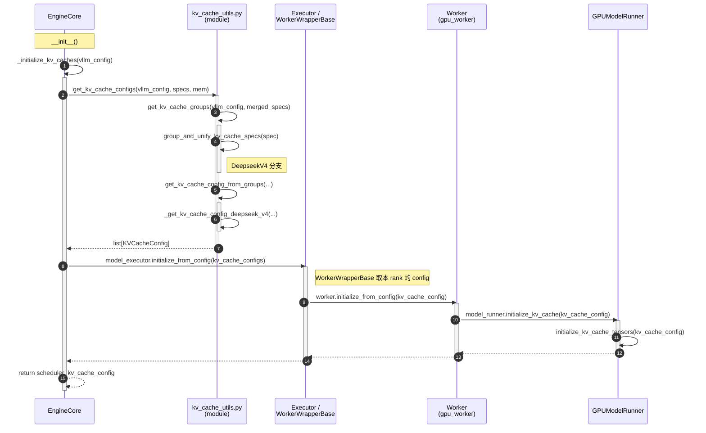

# 初始化
整个初始化的一些关键流程可以汇总成下面这张大图：


## KVCacheSpec

在 [[MLSys/Models/Deepseek V4|DeepSeek V4]] 中，存在以下几种 KVCacheSpec：
1. `DeepseekV4MLAAttention`
```python
def get_kv_cache_spec(self, vllm_config: VllmConfig) -> KVCacheSpec | None:
	if (
		self.compress_ratio <= 1
	):  # SWA part. Allocated separately as DeepseekV4SWACache.
		return None
	return MLAAttentionSpec(
		block_size=vllm_config.cache_config.block_size,
		num_kv_heads=1,
		head_size=self.head_dim,
		dtype=torch.uint8,
		compress_ratio=self.compress_ratio,
		cache_dtype_str=self.kv_cache_dtype,
		alignment=576,  # NOTE: FlashMLA requires 576B alignment
		model_version="deepseek_v4",
```
压缩后的 KV Cache，没有滑窗
2. `DeepSeekV4SWACache` 
```python
def get_kv_cache_spec(self, vllm_config: VllmConfig) -> KVCacheSpec:
	return SlidingWindowMLASpec(
		block_size=self.block_size,
		num_kv_heads=1,
		head_size=self.head_dim,
		dtype=self.dtype,
		sliding_window=self.window_size,
		cache_dtype_str=self.cache_config.cache_dtype,
		alignment=576,  # NOTE: FlashMLA requires 576B alignment
		model_version="deepseek_v4",
	)
```
未压缩的 KV Cache，有滑窗
3. `DeepseekV4IndexerCache`
```python
def get_kv_cache_spec(self, vllm_config: VllmConfig) -> KVCacheSpec:
	# head_dim already carries the fp8 scale padding
	# compress_ratio=1 for V3.2, >1 for DeepseekV4; both use the same cache layout.
	return MLAAttentionSpec(
		block_size=self.cache_config.block_size,
		num_kv_heads=1,
		head_size=self.head_dim,
		dtype=self.dtype,
		compress_ratio=self.compress_ratio,
		# DeepseekV4 aligns indexer pages to FlashMLA's 576B so they can pack with
		# the indexer's compressor state cache. V3.2 keeps the legacy layout.
		alignment=576,
	)
```
Indexer 的 Score Cache，没有滑窗
4. `CompressorStateCache`
```python
def get_kv_cache_spec(self, vllm_config: VllmConfig) -> KVCacheSpec:
	return SlidingWindowMLASpec(  # only has one vector instead of K + V
		block_size=self.block_size,
		num_kv_heads=1,
		head_size=self.state_dim,
		dtype=self.dtype,
		sliding_window=self.sliding_window,
		alignment=576,  # NOTE: FlashMLA requires 576B alignment
	)
```
Compressor 压缩 KV Cache时使用的 Score，有滑窗
## group_and_unify_kv_cache_specs
get_kv_cache_configs 中用来将上面这些 `KVCacheSpec` 分组并合并为同一的`UniformTypeKVCacheSpecs` 的函数
```python
def group_and_unify_kv_cache_specs(
    kv_cache_spec: dict[str, KVCacheSpec],
) -> list[UniformTypeKVCacheSpecs] | None:
    """
    Group the KV cache specs and unify each group into one UniformTypeKVCacheSpecs.
    Currently, this is only used for DeepseekV4.
    """
    if not any(
        isinstance(spec, SlidingWindowMLASpec) for spec in kv_cache_spec.values()
    ):
        return None

    mla_specs: dict[str, KVCacheSpec] = {}
    grouped_swa_mla_specs: dict[tuple[int, int], dict[str, KVCacheSpec]] = defaultdict(
        dict
    )
    # NOTE: Here we group SWA layers by (block_size, sliding_window), which separates
    # SWA layers, C4I+C4A layers, and C128A layers into three different groups. It can
    # be fragile with only block_size and sliding_window as keys, but fine for now.
    for name, spec in kv_cache_spec.items():
        if isinstance(spec, SlidingWindowMLASpec):
            grouped_swa_mla_specs[(spec.block_size, spec.sliding_window)][name] = spec
        elif isinstance(spec, MLAAttentionSpec):
            mla_specs[name] = spec

    assert len(mla_specs) > 0
    mla_uniform_spec = UniformTypeKVCacheSpecs.from_specs(mla_specs)
    assert mla_uniform_spec is not None

    swa_uniform_specs: list[UniformTypeKVCacheSpecs] = []
    for spec_dict in grouped_swa_mla_specs.values():
        uniform_spec = UniformTypeKVCacheSpecs.from_specs(spec_dict)
        assert uniform_spec is not None
        swa_uniform_specs.append(uniform_spec)

    return [mla_uniform_spec, *swa_uniform_specs]
```

整体逻辑比较简单，所有 `MLAAttentionSpec`  分成一组（block_size 相同），所有带滑窗的 Spec（`SlidingWindowMLASpec`)，按照(block_size, window_size)分组。这样其实整个模型会有 4 个 KVCache Group，MLA + C4A Compressor + C128A Compressor + SWA。
## \_get\_kv\_cache\_config\_deepseek\_v4
创建KVCacheGroupSpec 后，通过这个函数获取每个 group 对应的 KVCacheConfig，以及分配对应的 KVCacheTensor。
```python
def _get_kv_cache_config_deepseek_v4(
    vllm_config: VllmConfig,
    kv_cache_groups: list[KVCacheGroupSpec],
    available_memory: int,
) -> tuple[int, list[KVCacheTensor]]:
    """DeepseekV4 KV cache tensor layout planning.

    Precondition: kv_cache_groups[0] is the full-MLA group; its page sizes
    define the canonical bucket set. Non-full-MLA groups must have been
    page_size-padded upstream (see _get_kv_cache_groups_uniform_groups) so
    every layer's page_size matches one of the full-MLA bucket sizes.

    For each group, bucket its layers by page_size_bytes and place each
    layer at tuple_idx = position-within-bucket. Emit one KVCacheTensor
    per (tuple_idx, bucket) whose shared_by is the union of per-group
    layers at that slot.
    """
    full_mla_spec = kv_cache_groups[0].kv_cache_spec
    assert isinstance(full_mla_spec, UniformTypeKVCacheSpecs)
    page_sizes = sorted(full_mla_spec.get_page_sizes())
    layer_tuple_page_bytes = sum(page_sizes)

    # Pre-bucket each group's layers by page_size (registration order within
    # bucket). bucketed[g_idx][page_size] = [layer_name, ...].
    bucketed: list[dict[int, list[str]]] = []
    for group in kv_cache_groups:
        assert isinstance(group.kv_cache_spec, UniformTypeKVCacheSpecs)
        specs = group.kv_cache_spec.kv_cache_specs
        b: dict[int, list[str]] = defaultdict(list)
        for name in group.layer_names:
            b[specs[name].page_size_bytes].append(name)
        bucketed.append(b)

    # num_layer_tuples = longest bucket list across all groups. For the
    # full-MLA group this equals the count of layers in the largest
    # per-page-size bucket (= get_num_layer_tuples()); for SWA sub-groups
    # this equals the sub-group size (each has a single page_size).
    num_layer_tuples = max(len(layers) for b in bucketed for layers in b.values())

    num_blocks = available_memory // (layer_tuple_page_bytes * num_layer_tuples)
    num_blocks = may_override_num_blocks(vllm_config, num_blocks)

    kv_cache_tensors: list[KVCacheTensor] = []
    for tuple_idx in range(num_layer_tuples):
        for ps in page_sizes:
            shared_by: list[str] = []
            for b in bucketed:
                bucket = b.get(ps)
                if bucket is not None and tuple_idx < len(bucket):
                    shared_by.append(bucket[tuple_idx])
            kv_cache_tensors.append(
                KVCacheTensor(size=ps * num_blocks, shared_by=shared_by)
            )

    return num_blocks, kv_cache_tensors
```
这里的关键是根据page_size 和 layer_idx（代码里叫 tuple_idx），将拥有相同 page_size 和相同 layer_id 的 tensor 放到一个KVCacheTensor 中。(通过 shared_by参数)
 下面代码里的 bucketed 大概是这样的结构，按照 group 和 page_size 的二维 histgram
![[Drawing 2026-09-09 19.43.25.excalidraw]]
## initialize_kv_cache_tensors
上面得到的 KVCacheTensor 只是一些表示 KVCache size和 dtype 等的 metadata，实际的 KVCache 分配发生在 model_runner 的`initialize_kv_cache_tensors` 方法中。这里分三步走：
* alloc：`_allocate_kv_cache_tensors` 。根据 KVCacheTensor 中预先计算的大小分配数对应的一维 raw_tensor，比较简单
```python
def _allocate_kv_cache_tensors(
        self, kv_cache_config: KVCacheConfig
    ) -> dict[str, torch.Tensor]:
        """
        Initializes the KV cache buffer with the correct size. The buffer needs
        to be reshaped to the desired shape before being used by the models.

        Args:
            kv_cache_config: The KV cache config
        Returns:
            dict[str, torch.Tensor]: A map between layer names to their
            corresponding memory buffer for KV cache.
        """
        kv_cache_raw_tensors: dict[str, torch.Tensor] = {}
        for kv_cache_tensor in kv_cache_config.kv_cache_tensors:
            tensor = torch.zeros(
                kv_cache_tensor.size, dtype=torch.int8, device=self.device
            )
            for layer_name in kv_cache_tensor.shared_by:
                kv_cache_raw_tensors[layer_name] = tensor

        layer_names = set()
        for group in kv_cache_config.kv_cache_groups:
            for layer_name in group.layer_names:
                if layer_name in self.runner_only_attn_layers:
                    continue
                layer_names.add(layer_name)
        assert layer_names == set(kv_cache_raw_tensors.keys()), (
            "Some layers are not correctly initialized"
        )
        return kv_cache_raw_tensors
```
注意这里根据kv_cache_tensor的 shared_by 属性把上面分好组的 Layer 全部使用相同的底层 tensor。
* reshape：根据 attn_group、kv_cache_spec 里的具体 metadata， 将上面 alloc 出来的，没有shape 信息的的 raw tensor 添加一个对应的 view。
![[IMG-20260724125636975.svg|1033]]
这里注意 storage_block_size 这一概念。这个概念主要针对 Compressed KV Cache 的场景。将 storage block size 和上层框架使用的 block size 解耦，可以对上层框架隐藏 compressed KV的实现细节。上层框架仍然可以按照压缩前的 block size 处理。
* `bind_kv_cache` 主要是把上面分配的 KVCache按照layer_name，绑定到具体 Layer 的 `kv_cache` 字段。
```python
class AttentionLayerBase(ABC):
    """
    Base class for attention-like layers (Attention, Mamba, etc.)
    that support the v1 engine.

    This provides a common interface for getting attention backends
    from different layer types.
    """

    impl: "AttentionImpl"
    supports_dcp: bool = True

    def bind_kv_cache(self, kv_cache: torch.Tensor) -> None:
        """Bind the allocated KV cache tensor to this layer.

        The default stores the cache view as-is; subclasses (e.g. Mamba)
        override this to unpack the raw buffer into per-state views.
        """
        self.kv_cache = kv_cache
```

# Alloc

## 相关笔记

- [[source-code/vllm/vllm 源码随手记]]：vLLM KV Cache 整体架构与 Block 管理
- [[source-code/vllm/vLLM DP 协调、CUDA Graph 与 DeepEP Low Latency]]：vLLM 中 DeepSeek V4 相关的 DP/CUDA Graph 协同