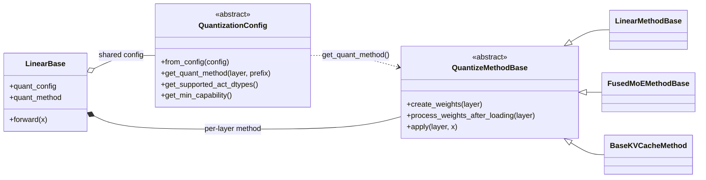
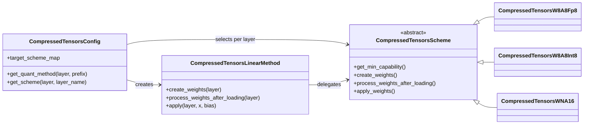

# 核心结论

vLLM 量化框架可以先抓住两层稳定的主干：

> [!abstract]
> `QuantizationConfig` 决定某个 layer 应采用什么量化实现，`QuantizeMethodBase` 接管这个 layer 的权重创建、加载后处理和 forward。`Scheme` 不是 vLLM 所有量化后端共有的抽象，而是 compressed-tensors 等复杂后端为了复用 `Method` 外壳、拆分具体 W/A 组合而增加的内部策略层。

```text
模型级配置                  layer 级执行策略                    后端内部细分
QuantizationConfig   ──→   QuantizeMethodBase          ──→   Scheme（可选）
选择 Method                管理权重与 forward                  选择具体格式/kernel
```

量化的 bit 数、对称/非对称、per-tensor/per-channel/per-group 等概念见 [[Model Quantization]]；vLLM 中 MoE Method 的具体类图见 [[vllm 源码随手记#FusedMOE]]。

# 类关系



这里使用的是组合加策略模式，而不是为每种量化方式派生一套 Linear layer：

```text
LinearBase.quant_method
├── UnquantizedLinearMethod
├── AWQLinearMethod
├── Fp8LinearMethod
└── CompressedTensorsLinearMethod
```

因此同一套 `ColumnParallelLinear`、`RowParallelLinear`、`QKVParallelLinear` 可以通过替换 `quant_method` 接入不同量化实现。这一设计对应 [[策略模式 (Strategy)]]。

# `QuantizationConfig`：模型级配置与 Method 工厂

`QuantizationConfig` 通常由 checkpoint 的 `quantization_config` 构造，并在模型各层之间共享。它负责：

- 解析并保存 bit 数、group size、activation scheme、block size、ignored layers 等配置；
- 声明支持的 activation dtype、最低硬件 capability 和配置文件名；
- 根据 `layer` 类型及其完整参数名前缀 `prefix` 判断该层是否量化；
- 通过 `get_quant_method(layer, prefix)` 为每个 layer 创建相应的 Method。

例如，同一个 `Fp8Config` 可以按 layer 类型返回：

```text
LinearBase      → Fp8LinearMethod
RoutedExperts   → Fp8MoEMethod
Attention       → Fp8KVCacheMethod
ignored layer   → Unquantized...Method
```

所以 Config 不只是被动的数据对象，它还承担 **layer 匹配器和 Method 工厂** 的职责。

> [!note] `quantization method` 的两种含义
> 配置文件中的 `quant_method: fp8/awq/...` 常指模型采用的量化后端或 checkpoint 格式；Python 类名中的 `*Method` 则指某一类 layer 的运行时执行策略。阅读源码时要结合上下文区分。

# `QuantizeMethodBase`：layer 级生命周期

`QuantizeMethodBase` 定义了量化实现接入 vLLM layer 的公共协议。

## `create_weights`

模型构造阶段创建并注册该层需要的参数，例如：

- packed weight；
- weight/activation scale；
- zero point；
- per-group 或 per-block scale。

参数通常直接注册到 layer 上，因为后续 checkpoint loader、TP weight loader 和 forward 都围绕 layer 工作。

## `process_weights_after_loading`

checkpoint 加载完后的预处理钩子，可用于：

- transpose 或 repack 权重；
- 合并或重排 scale；
- 转换 FP8 表示；
- 准备 Marlin、CUTLASS 等 kernel 需要的布局；
- online quantization 场景下将浮点权重逐层量化。

## `apply`

真正执行 forward，包括 activation quantization、量化 GEMM/MoE kernel、反量化和 bias 等后处理。

按照 layer 类型，`QuantizeMethodBase` 又派生出更具体的接口：

```text
QuantizeMethodBase
├── LinearMethodBase
├── FusedMoEMethodBase
└── BaseKVCacheMethod
```

其中 `LinearMethodBase.create_weights` 还接收 `input_size_per_partition`、`output_partition_sizes` 等参数。这说明 Method 不只关心量化公式，还必须理解 vLLM 的 Tensor Parallel 权重布局。

# `Scheme`：复杂后端内部的二次分发

`Scheme` 并不是 vLLM 的全局统一接口。AWQ、FP8 等后端通常直接把实现放进对应的 Linear/MoE Method：

```text
AWQConfig → AWQLinearMethod
Fp8Config → Fp8LinearMethod / Fp8MoEMethod / Fp8KVCacheMethod
```

compressed-tensors 需要支持 W8A8 INT8、W4A8 INT、W8A8 FP8、W8A16 FP8、W4A4 FP4、不同粒度及 static/dynamic activation 等大量组合，因此增加了 `CompressedTensorsScheme`：



`CompressedTensorsLinearMethod` 是接入 vLLM Linear 生命周期的统一外壳，具体操作委托给挂在 layer 上的 Scheme：

```python
def create_weights(self, layer, ...):
    layer.scheme.create_weights(layer=layer, ...)

def process_weights_after_loading(self, layer):
    layer.scheme.process_weights_after_loading(layer)

def apply(self, layer, x, bias=None):
    return layer.scheme.apply_weights(layer, x, bias)
```

这层拆分避免为每一种 W/A 组合复制一套完整的 `LinearMethodBase` 适配代码。

# `QuantizationArgs` 与 Scheme

compressed-tensors 中的 `QuantizationArgs` 是声明式数据，不是执行实现。它描述：

```yaml
weights:
  num_bits: 4
  type: int
  strategy: group
  group_size: 128
  symmetric: true
input_activations:
  num_bits: 8
  type: int
  strategy: token
  dynamic: true
```

对应的数据流是：

```text
checkpoint JSON
    ↓ 解析与校验
QuantizationArgs
    ↓ 匹配 layer、识别 W/A 组合
CompressedTensorsScheme
    ↓ create/process/apply
具体 kernel
```

- `QuantizationArgs`：描述想要的量化格式；
- `Scheme`：实现某一种具体格式组合；
- `Method`：将实现接入 vLLM layer 生命周期；
- `Config`：解析、匹配并完成选择。

# 完整调用链

以 compressed-tensors Linear 为例：

```text
checkpoint quantization_config
    ↓
CompressedTensorsConfig.from_config()
    ↓ 建立 target → QuantizationArgs 映射
LinearBase(..., quant_config, prefix)
    ↓
quant_config.get_quant_method(layer, prefix)
    ├── 根据 prefix 匹配 QuantizationArgs
    ├── get_scheme() 选择具体 Scheme
    ├── layer.scheme = CompressedTensorsW8A8Fp8(...)
    └── layer.quant_method = CompressedTensorsLinearMethod(config)
    ↓
quant_method.create_weights(layer)
    └── layer.scheme.create_weights(layer)
    ↓ checkpoint loading
quant_method.process_weights_after_loading(layer)
    └── layer.scheme.process_weights_after_loading(layer)
    ↓ forward
layer.quant_method.apply(layer, x)
    └── layer.scheme.apply_weights(layer, x)
    ↓
FP8 / INT8 / Marlin / CUTLASS / Triton kernel
```

# 定位速查

| 概念 | 范围 | 定位 |
|---|---|---|
| `QuantizationConfig` | 模型级、共享 | 解析配置、检查能力、匹配 layer、创建 Method |
| `QuantizeMethodBase` | layer 级 | 接管权重创建、加载后处理和 forward |
| `LinearMethodBase` / `FusedMoEMethodBase` | 特定 layer 类型 | 提供 Linear/MoE 专用执行协议 |
| `Scheme` | 特定后端、特定 layer | 实现某个具体 W/A 格式、粒度与 kernel 组合 |
| `QuantizationArgs` | 纯数据 | 描述 bit、粒度、对称性和 static/dynamic 等 |
| kernel | 单次算子执行 | 执行 quantized GEMM、MoE 等计算 |

# 源码入口

以下结构基于 2026-08-14 的 vLLM `main` 分支：

- [`base_config.py`](https://github.com/vllm-project/vllm/blob/main/vllm/model_executor/layers/quantization/base_config.py)：`QuantizationConfig`、`QuantizeMethodBase`
- [`linear.py`](https://github.com/vllm-project/vllm/blob/main/vllm/model_executor/layers/linear.py)：`LinearMethodBase`、`LinearBase` 及 Method 调用点
- [`fp8.py`](https://github.com/vllm-project/vllm/blob/main/vllm/model_executor/layers/quantization/fp8.py)：不经过 Scheme 的 Config → Method 示例
- [`compressed_tensors.py`](https://github.com/vllm-project/vllm/blob/main/vllm/model_executor/layers/quantization/compressed_tensors/compressed_tensors.py)：Config → Method → Scheme 的完整分发
- [`compressed_tensors_scheme.py`](https://github.com/vllm-project/vllm/blob/main/vllm/model_executor/layers/quantization/compressed_tensors/schemes/compressed_tensors_scheme.py)：Scheme 基类
