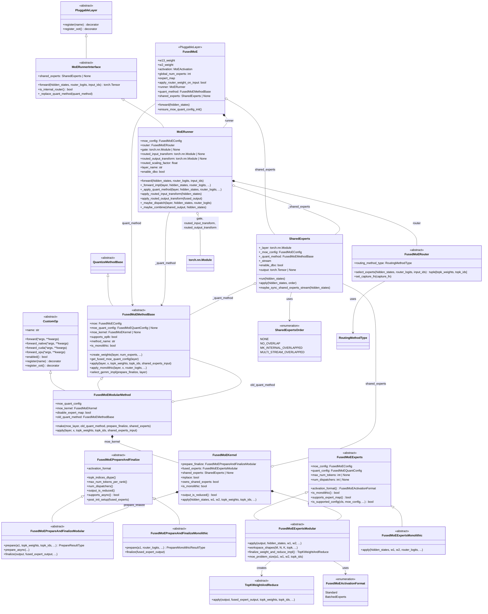

# KV Cache相关
## 整体架构

```mermaid
classDiagram
  direction TB

  %% =========================
  %% Scheduler-facing facade
  %% =========================

  class KVCacheManager {
    +KVCacheCoordinator coordinator
    +BlockPool block_pool
    +KVCacheConfig kv_cache_config
    +get_computed_blocks(request)
    +allocate_slots(request)
    +free(request)
  }

  class KVCacheBlocks {
    +blocks
    +get_block_ids()
    +get_unhashed_block_ids_all_groups()
  }

  class Request {
    +block_hashes
    +kv_transfer_params
    +skip_reading_prefix_cache
    +append_output_token_ids()
    +update_block_hashes()
    +get_skip_reading_prefix_cache()
  }

  KVCacheManager --> KVCacheCoordinator : owns
  KVCacheManager --> KVCacheBlocks : returns/uses
  KVCacheManager --> Request : schedules


  %% =========================
  %% Coordinator layer
  %% =========================

  class KVCacheCoordinator {
    <<abstract>>
    +KVCacheConfig kv_cache_config
    +BlockPool block_pool
    +single_type_managers
    +allocate_new_blocks()
    +cache_blocks()
    +free()
    +remove_skipped_blocks()
    +find_longest_cache_hit()*
  }

  class KVCacheCoordinatorNoPrefixCache {
    +find_longest_cache_hit()
  }

  class UnitaryKVCacheCoordinator {
    +find_longest_cache_hit()
  }

  class HybridKVCacheCoordinator {
    +hash_block_size
    +attention_groups
    +lcm_block_size
    +eagle_attn_group_indices
    +find_longest_cache_hit()
    +verify_and_split_kv_cache_groups()
  }

  KVCacheCoordinator <|-- KVCacheCoordinatorNoPrefixCache
  KVCacheCoordinator <|-- UnitaryKVCacheCoordinator
  KVCacheCoordinator <|-- HybridKVCacheCoordinator

  KVCacheCoordinator "1" o-- "*" SingleTypeKVCacheManager : per KV group
  KVCacheCoordinator --> BlockPool : shared physical blocks
  KVCacheCoordinator --> KVCacheConfig : reads groups/specs


  %% =========================
  %% Per-attention-type manager
  %% =========================

  class SingleTypeKVCacheManager {
    <<abstract>>
    +KVCacheSpec kv_cache_spec
    +BlockPool block_pool
    +req_to_blocks
    +num_cached_block
    +kv_cache_group_id
    +allocate_new_computed_blocks()
    +allocate_new_blocks()
    +cache_blocks()
    +free()
    +remove_skipped_blocks()
    +find_longest_cache_hit()*
  }

  class FullAttentionManager {
    +find_longest_cache_hit()
  }

  class SlidingWindowManager {
    +find_longest_cache_hit()
  }

  class ChunkedLocalAttentionManager {
    +find_longest_cache_hit()
  }

  class MambaManager {
    +find_longest_cache_hit()
  }

  class CrossAttentionManager {
    +find_longest_cache_hit()
  }

  class SinkFullAttentionManager {
    +find_longest_cache_hit()
  }

  SingleTypeKVCacheManager <|-- FullAttentionManager
  SingleTypeKVCacheManager <|-- SlidingWindowManager
  SingleTypeKVCacheManager <|-- ChunkedLocalAttentionManager
  SingleTypeKVCacheManager <|-- MambaManager
  SingleTypeKVCacheManager <|-- CrossAttentionManager
  FullAttentionManager <|-- SinkFullAttentionManager

  SingleTypeKVCacheManager --> BlockPool : alloc/free/cache
  SingleTypeKVCacheManager --> KVCacheSpec : behavior by spec
  SingleTypeKVCacheManager --> Request : per-request blocks


  %% =========================
  %% Physical block pool
  %% =========================

  class BlockPool {
    +blocks
    +free_block_queue
    +cached_block_hash_to_block
    +null_block
    +get_cached_block()
    +cache_full_blocks()
    +get_new_blocks()
    +touch()
    +free_blocks()
    +evict_blocks()
    +reset_prefix_cache()
    +get_usage()
  }

  class KVCacheBlock {
    +block_id
    +ref_cnt
    +block_hash
    +prev_free_block
    +next_free_block
    +is_null
    +reset_hash()
  }

  class FreeKVCacheBlockQueue {
    +popleft()
    +popleft_n()
    +remove()
    +append()
  }

  class BlockHashToBlockMap {
    +get_one_block()
    +insert()
    +pop()
  }

  class BlockHashListWithBlockSize {
    +target_block_size
    +source_block_size
    +source_hashes
  }

  BlockPool "1" o-- "*" KVCacheBlock : owns
  BlockPool "1" o-- "1" FreeKVCacheBlockQueue : eviction/free queue
  BlockPool "1" o-- "1" BlockHashToBlockMap : prefix cache map
  FreeKVCacheBlockQueue --> KVCacheBlock : linked list nodes
  BlockHashToBlockMap --> KVCacheBlock : hash to block
  HybridKVCacheCoordinator ..> BlockHashListWithBlockSize : convert hash block size


  %% =========================
  %% KV cache config/spec layer
  %% =========================

  class KVCacheConfig {
    +num_blocks
    +kv_cache_tensors
    +kv_cache_groups
    +has_mamba_layers
    +needs_kv_cache_zeroing
  }

  class KVCacheGroupSpec {
    +layer_names
    +kv_cache_spec
    +is_eagle_group
  }

  class KVCacheSpec {
    <<abstract>>
    +block_size
    +page_size_bytes
    +max_memory_usage_bytes()
  }

  class AttentionSpec {
    +num_kv_heads
    +head_size
    +dtype
    +kv_quant_mode
    +page_size_padded
  }

  class FullAttentionSpec {
    +head_size_v
    +sliding_window
    +attention_chunk_size
  }

  class SlidingWindowSpec {
    +sliding_window
    +head_size_v
    +max_admission_blocks_per_request()
  }

  class ChunkedLocalAttentionSpec {
    +max_admission_blocks_per_request()
  }

  class MambaSpec {
    +state_size
  }

  class CrossAttentionSpec {
  }

  class UniformTypeKVCacheSpecs {
    +kv_cache_specs
  }

  KVCacheConfig "1" o-- "*" KVCacheGroupSpec
  KVCacheGroupSpec --> KVCacheSpec

  KVCacheSpec <|-- AttentionSpec
  AttentionSpec <|-- FullAttentionSpec
  AttentionSpec <|-- SlidingWindowSpec
  AttentionSpec <|-- ChunkedLocalAttentionSpec
  AttentionSpec <|-- CrossAttentionSpec
  KVCacheSpec <|-- MambaSpec
  KVCacheSpec <|-- UniformTypeKVCacheSpecs


  %% =========================
  %% Config / HMA / KV transfer
  %% =========================

  class VllmConfig {
    +scheduler_config
    +kv_transfer_config
  }

  class SchedulerConfig {
    +disable_hybrid_kv_cache_manager
  }

  class KVConnectorFactory {
    +create_connector()
  }

  class KVConnectorBase_V1 {
    <<abstract>>
  }

  class SupportsHMA {
    <<interface>>
    +request_finished_all_groups(request, block_ids)
  }

  class HMACapableConnector {
    <<example>>
    DecodeBenchConnector
    MultiConnector
    OffloadingConnector
    NixlConnector
    MooncakeConnector
  }

  VllmConfig --> SchedulerConfig : sets HMA policy
  SchedulerConfig ..> HybridKVCacheCoordinator : enable/disable hybrid manager
  KVConnectorFactory ..> SchedulerConfig : checks HMA enabled
  KVConnectorFactory ..> SupportsHMA : requires when HMA enabled
  KVConnectorBase_V1 <|-- HMACapableConnector
  SupportsHMA <|.. HMACapableConnector

```

## KVCacheSpec
![[Drawing 2026-06-04 19.22.08.excalidraw|800]]

# FusedMOE
![[Drawing 2026-06-16 20.09.42.excalidraw]]

# Preprocess
![[Drawing 2026-06-22 19.59.23.excalidraw]]
## get_slot_mappings
这个函数本身只是构建（slot_mappings_by_gid, slot_mappings_by_layer）两个结构，slot_mapping 的处理再 prepare_inputs 里。
```python

def _get_slot_mappings(
        self,
        num_tokens_padded: int,
        num_reqs_padded: int,
        num_tokens_unpadded: int,
        ubatch_slices: "UBatchSlices | None" = None,
    ) -> tuple[
        dict[int, torch.Tensor] | None,
        dict[str, torch.Tensor] | list[dict[str, torch.Tensor]] | None,
    ]:
        """
        Build slot mappings in both formats needed by the system.

        Args:
            num_tokens_padded: Total number of tokens (padded)
            num_reqs_padded: Total number of requests (padded)
            num_tokens_unpadded: Actual number of tokens (unpadded)
            ubatch_slices: Optional ubatch slicing info for DBO

        Returns:
            A tuple of:
            - slot_mappings_by_gid: dict[int, torch.Tensor] for attention metadata
            - slot_mappings_by_layer: dict[str, torch.Tensor] or list for ForwardContext
        """
        if not (
            hasattr(self, "kv_cache_config")
            and self.kv_cache_config is not None
            and len(self.kv_cache_config.kv_cache_groups) > 0
        ):
            return None, None

        def _get_slot_mapping(kv_cache_gid: int):
            assert num_reqs_padded is not None and num_tokens_padded is not None
            kv_cache_spec = self.kv_cache_config.kv_cache_groups[
                kv_cache_gid
            ].kv_cache_spec
            if isinstance(kv_cache_spec, EncoderOnlyAttentionSpec):
                slot_mapping = torch.zeros(
                    (num_tokens_padded,),
                    dtype=torch.int64,
                    device=self.device,
                )
            else:
	            # 不同的kv cache group 有自己的 block table，同一 group 内的所有 layer 共享同一组 slot mapping.
                blk_table = self.input_batch.block_table[kv_cache_gid]
                slot_mapping = blk_table.slot_mapping.gpu[:num_tokens_padded]

            # Fill unused with -1. Needed for reshape_and_cache in full cuda
            # graph mode. `blk_table_tensor` -1 to match mamba PAD_SLOT_ID
            slot_mapping[num_tokens_unpadded:num_tokens_padded].fill_(-1)

            return slot_mapping

        slot_mappings_by_gid = {
            gid: _get_slot_mapping(gid)
            for gid, _ in enumerate(self.kv_cache_config.kv_cache_groups)
        }

        slot_mappings_by_layer: dict[str, torch.Tensor] = {}
        for gid, kv_cache_group in enumerate(self.kv_cache_config.kv_cache_groups):
            slot_mapping = slot_mappings_by_gid[gid]
            for layer_name in kv_cache_group.layer_names:
                slot_mappings_by_layer[layer_name] = slot_mapping

        if ubatch_slices is not None:
            result: list[dict[str, torch.Tensor]] = []
            for ubatch in ubatch_slices:
                sliced_mappings: dict[str, torch.Tensor] = {}
                for layer_name, slot_mapping in slot_mappings_by_layer.items():
                    sliced_mappings[layer_name] = slot_mapping[ubatch.token_slice]
                result.append(sliced_mappings)
            return slot_mappings_by_gid, result

        return slot_mappings_by_gid, slot_mappings_by_layer
```



* FusedMoeMethodBase: 所有Modular 和 base quantization method 的基类
```python
def use_all2all_kernels(self):
        return self.dp_size > 1 and self.use_ep
```
* use_all2all_kernels：只有 dp_size > 1 且开启 EP，才需要 all_to_all
# 一些triton算子
## eagle_prepare_next_token_padded_kernel
* Spec Decode 前处理算子，在`prepare_next_token_ids_padded` 里
* 一句话总结：从每个请求里把 bonus token 给拿出来
```python
def eagle_prepare_next_token_padded_kernel(
    sampled_token_ids_ptr,  # [num_reqs, num_sampled_tokens_per_req]
    discard_request_mask_ptr,  # [num_reqs]
    backup_next_token_ids_ptr,  # [num_reqs]
    next_token_ids_ptr,  # [num_reqs] (output)
    valid_sampled_tokens_count_ptr,  # [num_reqs] (output)
    vocab_size,  # tl.int32
    num_sampled_tokens_per_req,  # tl.int32 (num_spec_tokens + 1)
    num_reqs,  # tl.int32
    stride_sampled_token_ids,  # tl.int32 (stride for dim 0)
    BLOCK_SIZE_TOKENS: tl.constexpr,  # Power-of-2 >= num_sampled_tokens_per_req
):
    """
    Fused kernel for Eagle prepare_next_token_ids_padded. This kernel computes the
    number of valid (1 + accepted) tokens for each request, and the corresponding
    "next" token id to sample from during speculative decoding. This is the
    "last accepted token" from the sampled tokens, or the backup token if no
    tokens were accepted or if the request is marked as discarded.
    """
    req_idx = tl.program_id(axis=0)
    if req_idx >= num_reqs:
        return

    # Check if this request is discarded.
    is_discarded = tl.load(discard_request_mask_ptr + req_idx)

    if is_discarded:
        backup_token = tl.load(backup_next_token_ids_ptr + req_idx)
        valid_count = tl.full((), 0, dtype=tl.uint32)
        tl.store(next_token_ids_ptr + req_idx, backup_token)
        tl.store(valid_sampled_tokens_count_ptr + req_idx, valid_count)
    else:
        # Count the number of valid tokens among the sampled tokens.
        token_offs = tl.arange(0, BLOCK_SIZE_TOKENS)
        token_mask = token_offs < num_sampled_tokens_per_req

        row_ptr = sampled_token_ids_ptr + req_idx * stride_sampled_token_ids
        token_ids = tl.load(row_ptr + token_offs, mask=token_mask, other=-1)

        # Rejected tokens are -1, valid tokens are in [0, vocab_size)
        is_valid_mask = (token_ids != -1) & (token_ids < vocab_size) & token_mask
        valid_count = tl.sum(is_valid_mask)

        if valid_count > 0:
            # Guaranteed to be well-defined since
            # valid_count > 0 implies is_valid_mask is not empty
            last_valid_index = tl.max(tl.where(is_valid_mask, token_offs, -1))

            # Select the token at that index, using a sum trick since
            # we don't want to load again to access token_ids[last_valid_index].
            last_valid_token = tl.sum(
                tl.where(token_offs == last_valid_index, token_ids, 0)
            )
            tl.store(next_token_ids_ptr + req_idx, last_valid_token)
        else:
            # No valid tokens found, use backup token
            backup_token = tl.load(backup_next_token_ids_ptr + req_idx)
            tl.store(next_token_ids_ptr + req_idx, backup_token)

        tl.store(valid_sampled_tokens_count_ptr + req_idx, valid_count)
```

## Related
- [[vLLM 监控：使用 Binary 部署 Prometheus + Grafana]]
- [[SGLang Efficient Execution of Structured Language Model Programs]]
- [[top_k_top_p sampling]]