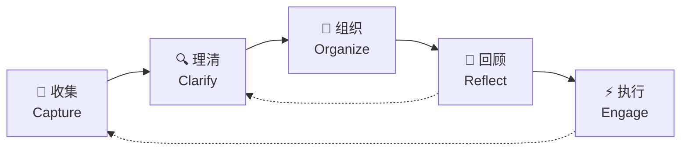
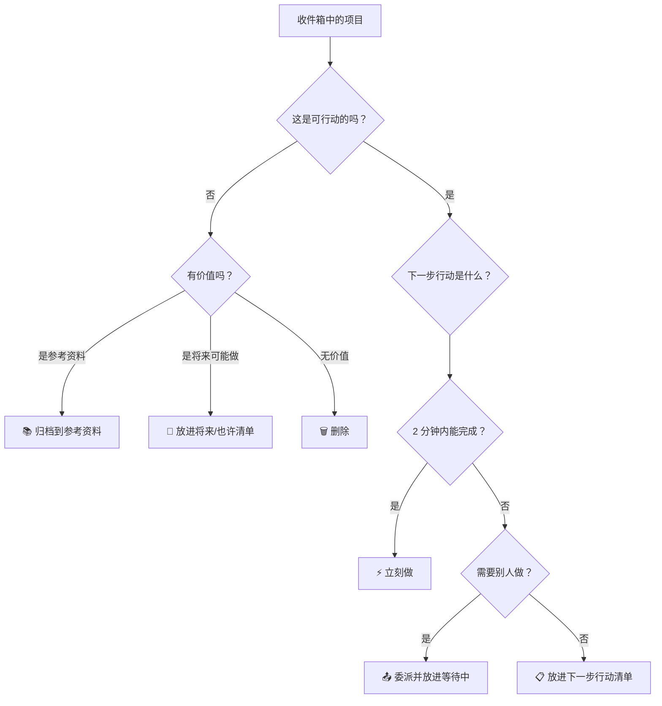

> **核心理念：大脑是用来思考的，不是用来记忆的。**

[[David Allen]] 于 2001 年提出的一套任务管理方法论。将所有悬而未决的事务外化到一个可信赖的外部系统，让大脑从"记挂"中解放出来，专注当下。

---

## 一、GTD 五步流程



---

## 二、每一步详解

### 1. 收集（Capture）

**原则：不遗漏，不判断，不组织。**

把所有进入你意识的东西——想法、待办、邮件、会议、灵感——**全部**丢进一个"收件箱"（Inbox）。

| ✅ 应该收集的 | ❌ 不应该做的 |
|---|---|
| 突然冒出的想法 | 在收集时思考优先级 |
| 别人交代的事 | 在收集时拆解任务 |
| 邮件/消息中需要行动的事 | 担心"这个不重要" |
| 读到的有价值的信息 | 试图分类或归档 |

**关键洞察：**
> 大脑会不断提醒你"别忘了 X"，这种"悬而未决"（Open Loop）是焦虑的主要来源。收集的目的就是关闭这些循环。

**工具建议：**
- [[Todoist]] 的 Inbox
- [[嘀嗒清单]] 的收集箱
- 物理笔记本（最原始但最可靠）
- 手机语音备忘录

---

### 2. 理清（Clarify）

对收件箱里的每一项，依次问以下问题：




**"下一步行动"的黄金法则：**
- 必须是一个**动词开头**的可执行动作
- ✅ "给张三发邮件问报价"
- ❌ "处理项目 A"
- ❌ "研究一下市场"

---

### 3. 组织（Organize）

GTD 的清单体系：

| 清单类型         | 用途         | 示例           |
| ------------ | ---------- | ------------ |
| **📅 日程表**   | 有明确时间/日期的事 | 周三 14:00 开会  |
| **📋 下一步行动** | 当前可执行的具体动作 | 按上下文分组       |
| **📂 项目清单**  | 需要多步骤完成的事  | 任何需要 2+ 行动的事 |
| **⏳ 等待中**    | 委派出去等回复的事  | 等张三的报价       |
| **🔮 将来/也许** | 现在不做但以后可能做 | 学日语、换工作      |
| **📚 参考资料**  | 不需要行动但需留存  | 发票、文章、笔记     |

**上下文（Context）分组：**

上下文是 GTD 的精髓——按"你在什么情境下能做"来分组，而非按项目：

| 上下文标签 | 使用场景 |
|---|---|
| `@电脑` | 需要电脑时做的事 |
| `@电话` | 可以打电话时做的事 |
| `@外出` | 在外面跑腿时做的事 |
| `@办公室` | 在办公室才能做的事 |
| `@家` | 在家才能做的事 |
| `@碎片时间` | 5 分钟内能完成的杂事 |

> 💡 **为什么按上下文而非项目分组？** 因为你在任何时刻的选择依据是"我现在有什么资源"，而不是"这个项目进行到哪了"。

---

### 4. 回顾（Review）

**这是 GTD 的发动机。不做回顾，系统就会腐烂。**

#### 每日回顾（Daily Review）— 5-10 分钟
- [ ] 清空 Inbox
- [ ] 检查日程表（今天和明天）
- [ ] 浏览"等待中"清单，是否需要催办
- [ ] 选择今天的优先行动

#### 每周回顾（Weekly Review）— 1-2 小时

```markdown
## 📋 每周回顾清单

### 1. 清空收集
- [ ] 清空物理收件箱
- [ ] 清空数字收件箱（邮件、消息、笔记）
- [ ] 清空语音备忘录
- [ ] 清空大脑（快速写下所有悬而未决的事）

### 2. 理清收件箱
- [ ] 处理所有收集到的项目（按理清流程图）

### 3. 回顾清单
- [ ] 回顾"下一步行动"清单（删除已完成、更新状态）
- [ ] 回顾"等待中"清单（是否需要跟进？）
- [ ] 回顾"项目"清单（每个项目是否都有下一步行动？）
- [ ] 回顾"将来/也许"清单（有没有可以启动的？）
- [ ] 回顾日程表（过去一周遗漏了什么？未来一周有什么？）

### 4. 创造性思考
- [ ] 有没有新项目需要创建？
- [ ] 有没有可以委派的事？
- [ ] 本周有什么收获/教训？
```

> 🔥 **关键洞察：** Weekly Review 不是"整理清单"，而是**重新建立对系统的信任**。信任一旦建立，大脑就会停止焦虑。

---

### 5. 执行（Engage）

GTD 不教你"先做重要的事"（那是 [[Eisenhower 矩阵]]），而是教你**根据当下情境选择行动**。

#### 四维度筛选模型

当你面对清单时，问自己：

| 维度 | 问题 |
|---|---|
| **情境** | 我现在在哪里？有什么工具？ |
| **时间** | 我现在有多少时间？ |
| **精力** | 我现在精力充沛还是疲惫？ |
| **优先级** | 这件事有多重要？ |

#### 三种工作模式

1. **执行预定工作**（日程表上的事）— 最高优先级
2. **执行定义好的工作**（下一步行动清单）— 日常主力
3. **定义工作**（处理收件箱、创建项目）— 维护系统

---

## 三、GTD 核心概念速查

| 概念 | 定义 | 常见误区 |
|---|---|---|
| **Open Loop** | 悬而未决、占用大脑内存的事 | 以为"记下来就完了"，其实需要下一步行动 |
| **Next Action** | 推进某事的**下一个物理可见动作** | 写成"处理 X"而非具体动作 |
| **Project** | 任何需要 **2+ 个行动** 才能完成的事 | 以为项目很大才算，其实"买打印机"也是项目 |
| **2 分钟法则** | 能在 2 分钟内完成的，立刻做 | 滥用导致整天做琐事 |
| **Someday/Maybe** | 现在不做但以后可能做 | 变成垃圾堆，从不回顾 |
| **Weekly Review** | 每周一次的系统维护 | 最容易跳过，也是最关键的一步 |

---

## 四、GTD 与工具映射

### Todoist 中的 GTD 实现

| GTD 概念 | Todoist 实现 |
|---|---|
| 收件箱 | **Inbox**（默认项目） |
| 下一步行动 | 任务 + 标签（`@电脑`、`@电话`） |
| 项目 | Projects（可嵌套子项目） |
| 等待中 | 标签 `waiting_for` 或专门项目 |
| 将来/也许 | 标签 `someday` 或专门项目 |
| 日程表 | 任务的截止日期/时间 |
| 上下文筛选 | **过滤器**（Filter）语法 |

**Todoist 过滤器示例：**
```
# 今天在家能做的事
today & @家

# 高优先级且逾期的任务
overdue & p1

# 等待中需要跟进的
@waiting_for & (no date | before: 7 days)

# 本周需要回顾的项目相关任务
#项目A & (no date | today | 7 days)
```

### 嘀嗒清单中的 GTD 实现

| GTD 概念 | 嘀嗒清单实现 |
|---|---|
| 收件箱 | 收集箱 |
| 下一步行动 | 任务 + 标签/清单 |
| 项目 | 清单（文件夹） |
| 等待中 | 标签或专门清单 |
| 日程表 | 日历视图（原生支持很好） |
| 番茄钟 | 内置（GTD 本身没有，但有助于执行） |

---

## 五、常见陷阱与对策

| 陷阱 | 症状 | 对策 |
|---|---|---|
| **收集癖** | 清单越来越长，从不清理 | 严格执行 Weekly Review，敢于删除 |
| **过度拆解** | 花 30 分钟规划一个 10 分钟的任务 | 2 分钟法则 + 适度拆解 |
| **完美主义** | 系统太复杂，维护成本太高 | 从简开始，逐步完善 |
| **不做回顾** | 系统失效，大脑重新开始焦虑 | 固定时间块，把 Weekly Review 放进日程表 |
| **上下文滥用** | 标签太多，选择困难 | 上下文控制在 5-7 个 |
| **把 GTD 当待办清单** | 只列任务，不定义下一步行动 | 每个项目必须有至少一个 Next Action |

---

## 六、GTD 进阶：与深度工作结合

GTD 解决的是"不遗漏"和"减少焦虑"，但不直接解决"如何高效产出"。建议结合：

- [[深度工作]]（Cal Newport）：用 GTD 清空大脑，用时间块专注产出
- [[番茄工作法]]：执行阶段的时间管理
- [[Eisenhower 矩阵]]：在 GTD 的"下一步行动"中筛选优先级

---

## 七、推荐阅读

1. **《搞定》**（Getting Things Done）— David Allen，方法论原典
2. **《搞定 II》**— 更偏实践指南
3. **《深度工作》**— Cal Newport，GTD 之后的执行层面

---

## 八、快速启动清单

如果你是 GTD 新手，按这个顺序开始：

- [ ] 选一个工具（[[Todoist]] 或 [[嘀嗒清单]] 或纸笔）
- [ ] 设置一个 Inbox
- [ ] 花 30 分钟做"大脑清空"——写下所有悬而未决的事
- [ ] 按理清流程处理它们
- [ ] 创建你的第一个"下一步行动"清单
- [ ] 在日历上固定每周回顾的时间
- [ ] 坚持 4 周，再调整系统

---

> *"你的大脑是一个糟糕的办公室。它的设计是用来产生想法，而不是保存想法。"*
> — David Allen
