# Mermaid 使用指南

Mermaid 是一种基于文本的图表绘制工具，用简单的 Markdown 语法生成各种图表。Obsidian 原生支持 Mermaid，使用 `mermaid` 代码块即可。

## 基本语法

````markdown
```mermaid
图表代码
```
````

---

## 1. 流程图（Flowchart）

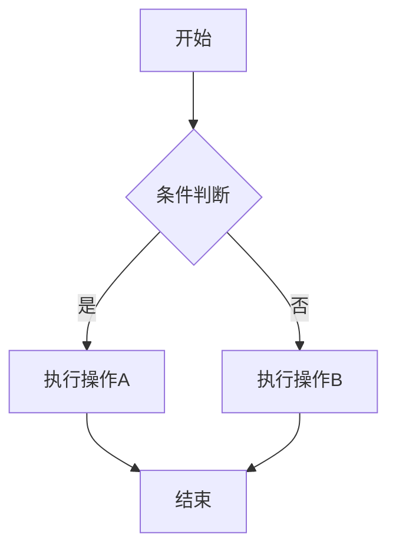

### 方向
- `TD` / `TB` — 从上到下（Top Down）
- `LR` — 从左到右
- `RL` — 从右到左
- `BT` — 从下到上

### 节点形状
| 语法 | 形状 |
|------|------|
| `[文本]` | 矩形 |
| `(文本)` | 圆角矩形 |
| `{文本}` | 菱形 |
| `((文本))` | 圆形 |
| `>文本]` | 旗帜形（右向） |
| `[/文本/]` | 平行四边形 |

### 连线样式
| 语法     | 效果    |     |        |
| ------ | ----- | --- | ------ |
| `-->`  | 实线箭头  |     |        |
| `---`  | 实线无箭头 |     |        |
| `-.->` | 虚线箭头  |     |        |
| `==>`  | 粗线箭头  |     |        |
| `-->   | 文本    | `   | 带标签的连线 |

---

## 2. 时序图（Sequence Diagram）

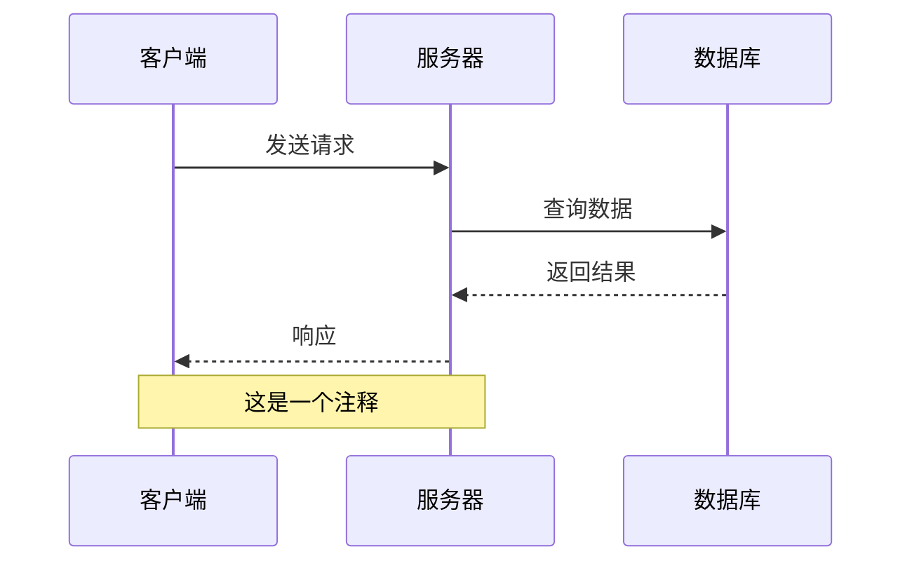

### 消息类型
| 语法 | 说明 |
|------|------|
| `->>` | 实线箭头（同步） |
| `-->>` | 虚线箭头（异步/返回） |
| `->` | 实线无箭头 |
| `-->` | 虚线无箭头 |

### 其他功能
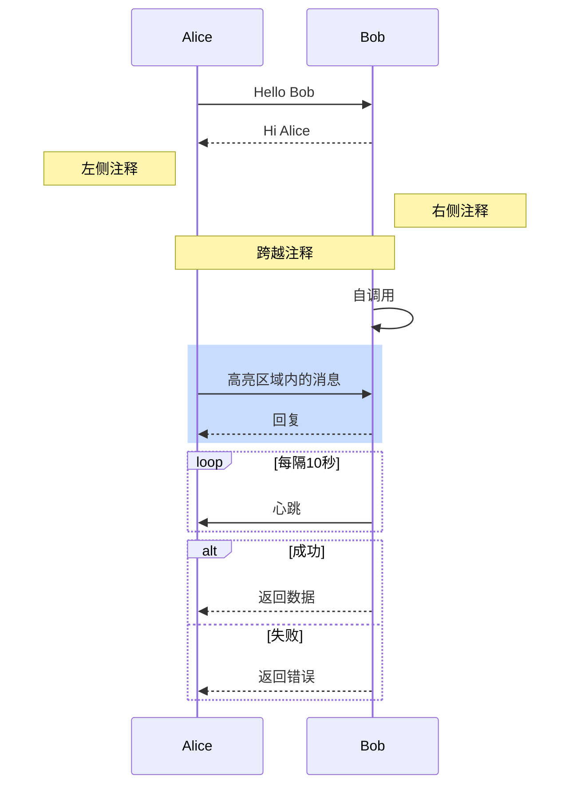

---

## 3. 类图（Class Diagram）

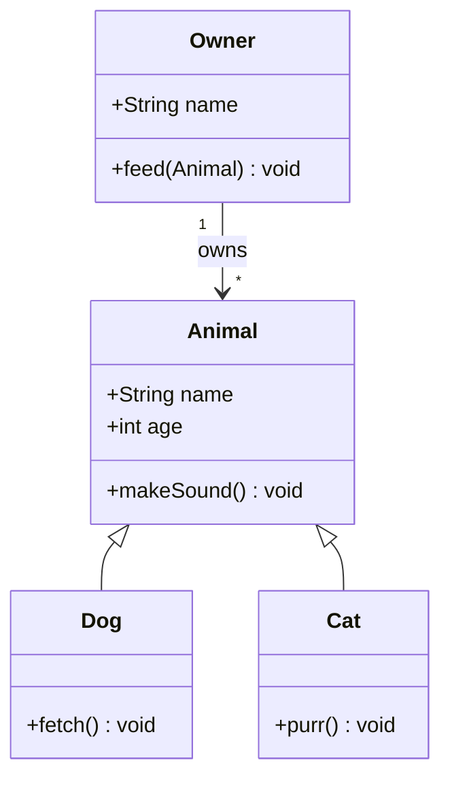

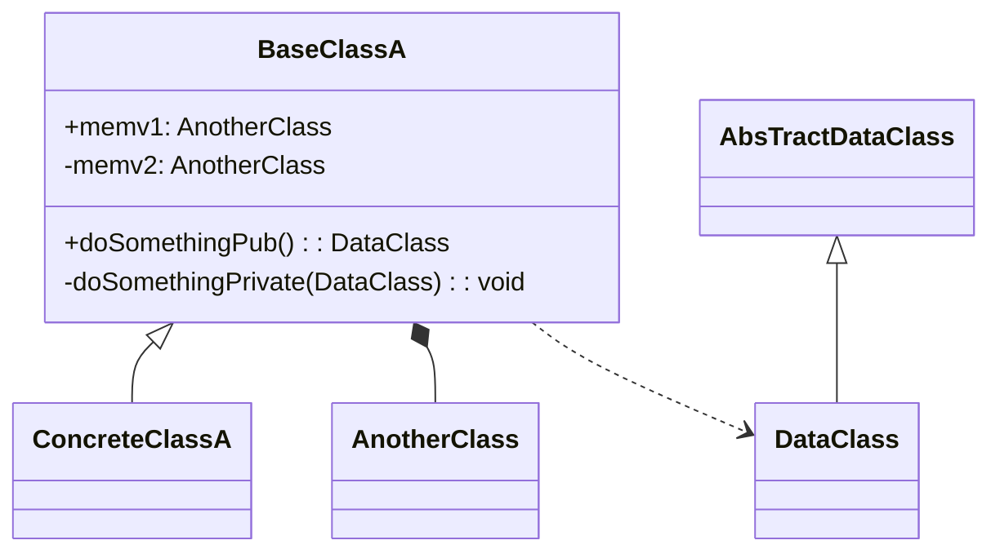
### 访问修饰符
| 符号 | 含义 |
|------|------|
| `+` | public |
| `-` | private |
| `#` | protected |
| `~` | package/internal |

### 关系类型
| 语法      | 关系         |     |
| ------- | ---------- | --- |
| `<\|--` | 继承（泛化）<br> |     |
| `*--`   | 组合         |     |
| `o--`   | 聚合         |     |
| `-->`   | 关联         |     |
| `..>`   | 依赖         |     |
| `--`    | 实线链接       |     |
| `..`    | 虚线链接       |     |

> **方向提示**：`*`（实心菱形）和 `o`（空心菱形）都冲着**整体**那一侧。语法格式为 `整体 *-- 部分` / `整体 o-- 部分`。如 `人 *-- 心脏`，`*` 在人那边，表示人是整体，心脏是部分。

### 关系的语义区别

按耦合度从强到弱：

- **组合（Composition）**：整体没了，部分也跟着没了。如人和心脏，人死了心脏也死了。
- **聚合（Aggregation）**：整体没了，部分还能独立存在。如部门和员工，部门解散了员工还活着。
- **关联（Association）**：我知道你，我会用你。如老师和学生，各自独立，但互相认识。
- **依赖（Dependency）**：我临时用你一下，用完就忘。如司机开车，车作为参数传入，方法结束后不持有。

### C++ 中的对应写法

| UML 关系 | C++ 对应 | 关键特征 |
|----------|---------|---------|
| 组合 | **值成员**（`Heart heart_`） | 成员变量是对象本身，跟着宿主构造/析构 |
| 聚合 | **裸指针/智能指针**（`Employee*`） | 指向外部对象，不负责释放 |
| 关联 | **裸指针/智能指针**（`Student*`） | 和聚合类似，常为双向 |
| 依赖 | **方法参数/局部变量**（`void drive(Car&)`） | 不持有引用，用完即弃 |

```cpp
// 组合 — 值成员，生命周期绑定
class Person {
    Heart heart_;  // 构造时创建，析构时销毁
};

// 聚合 — 指针，不拥有所有权
class Department {
    std::vector<Employee*> employees_;  // Department 销毁时 Employee 还活着
public:
    void add(Employee* e) { employees_.push_back(e); }
};

// 关联 — 双向认识
class Teacher;
class Student {
    std::vector<Teacher*> teachers_;
};
class Teacher {
    std::vector<Student*> students_;
};

// 依赖 — 方法参数，临时使用
class Driver {
public:
    void drive(Car& car) {  // 方法结束后不持有 car
        car.start();
    }
};
```

> **实践建议**：聚合和关联在 C++ 里几乎没区别，都是存指针，不用太纠结。现代 C++ 中，聚合/关联推荐用 `std::shared_ptr` 或 `std::weak_ptr`，组合直接用值成员。

---

## 4. 状态图（State Diagram）

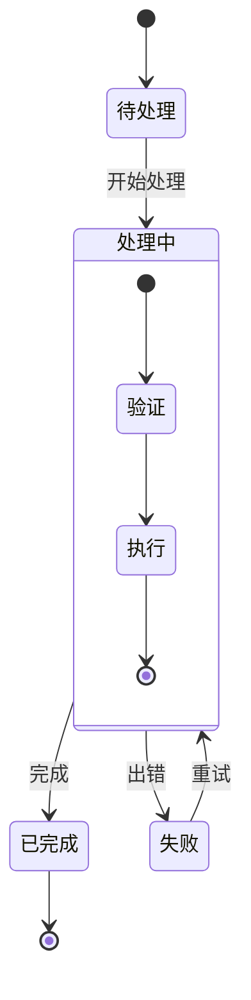

---

## 5. 饼图（Pie）

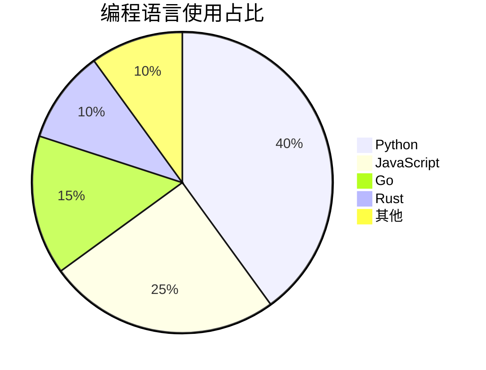

---

## 6. 甘特图（Gantt）

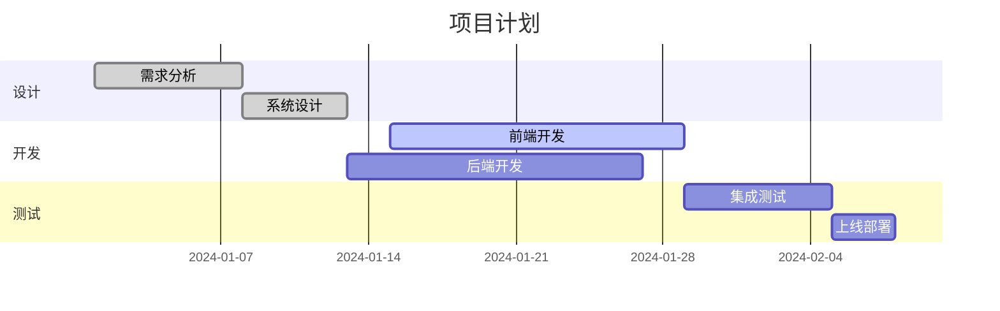

### 任务状态
| 关键字 | 含义 |
|--------|------|
| `done` | 已完成 |
| `active` | 进行中 |
| （无） | 未开始 |

---

## 7. ER 图（实体关系图）

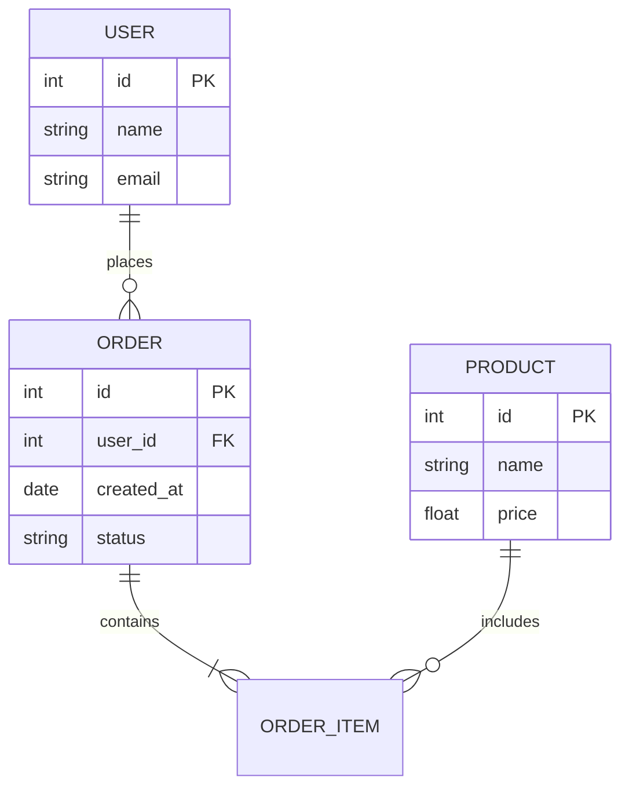

### 关系基数
| 语法 | 含义 |
|------|------|
| `||--||` | 一对一 |
| `||--o{` | 一对多 |
| `}o--o{` | 多对多 |
| `}|--|{` | 一对多（至少一个） |

---

## 8. 思维导图（Mindmap）

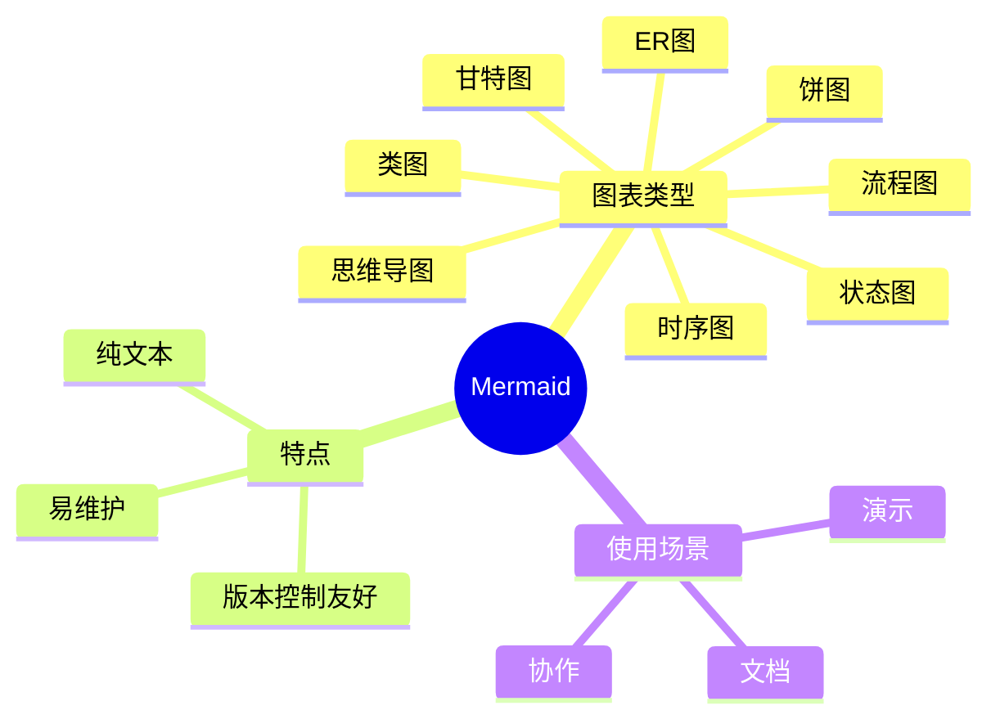

---

## 9. 象限图（Quadrant Chart）

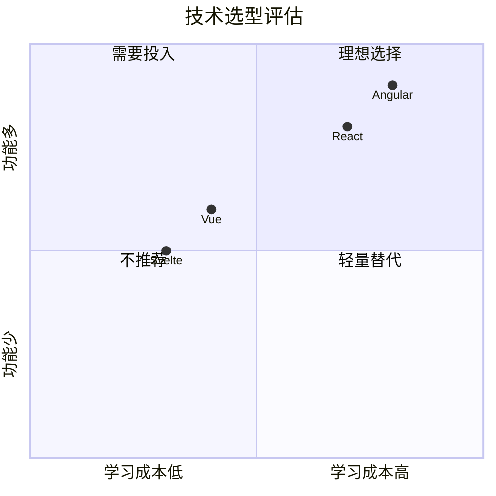

---

## 10. Git 图（Gitgraph）

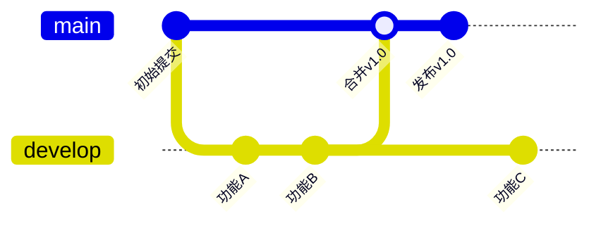

---

## Obsidian 中的使用技巧

### 1. 实时预览
在 Obsidian 编辑器中切换到阅读模式或使用实时预览即可看到渲染后的图表。

### 2. 主题适配
Mermaid 图表会自动适配 Obsidian 的亮色/暗色主题。

### 3. 缩放
渲染后的图表支持鼠标滚轮缩放和拖拽移动。

### 4. 嵌入到其他笔记
```markdown
![[Mermaid 使用指南#1. 流程图（Flowchart）]]
```

### 5. 导出
Mermaid 图表可以通过截图或 Obsidian 插件导出为 SVG/PNG。

---

## 常见问题

### Q: 图表不渲染？
- 检查代码块标记是否为 ` ```mermaid `
- 检查语法是否有错误
- 切换到阅读模式查看

### Q: 中文显示异常？
确保节点文本用引号包裹，或使用 `["中文文本"]` 格式。

### Q: 想用更复杂的图表？
考虑使用 [Excalidraw](Excalidraw/) 手绘风格图表，或导出 Mermaid 代码到 [Mermaid Live Editor](https://mermaid.live) 编辑。

## Related
- [[Mermaid Zoom 插件]]
