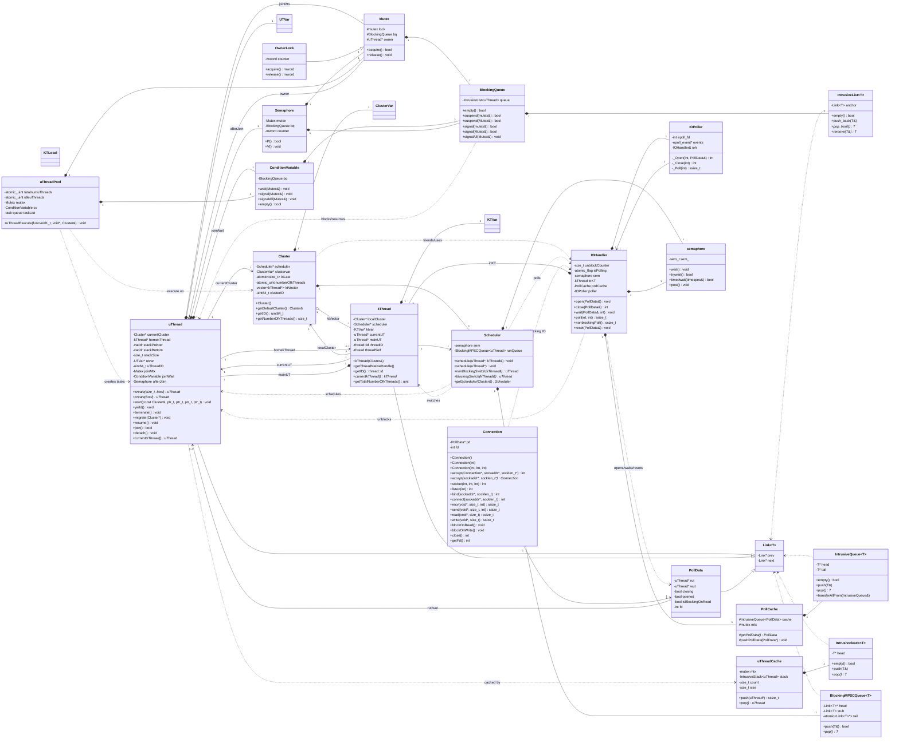

This diagram focuses on the core runtime, synchronization, scheduler, and
network I/O classes. The active `Scheduler` class is selected at compile time by
`SCHEDULERNO`; when it is not defined, `Scheduler_02.h` is used.

## Notes

- `Scheduler_01.h`, `Scheduler_02.h`, `Scheduler_03.h`, and `Scheduler_04.h`
  all define a class named `Scheduler`. `src/runtime/schedulers/Scheduler.h`
  picks exactly one of them with `SCHEDULERNO`; the diagram shows the default
  `Scheduler_02.h` shape.
- `OwnerLock` inherits from `Mutex` with protected inheritance in the code.
- `IOHandler` is implemented as a singleton-like static handler in the current
  source (`IOHandler::iohandler`) and owns an I/O `kThread`, `PollCache`, and
  Linux `IOPoller`.
- `Link<T>` must be the first base/member layout element for intrusive
  containers to reinterpret objects safely, as noted in
  `IntrusiveContainers.h`.
