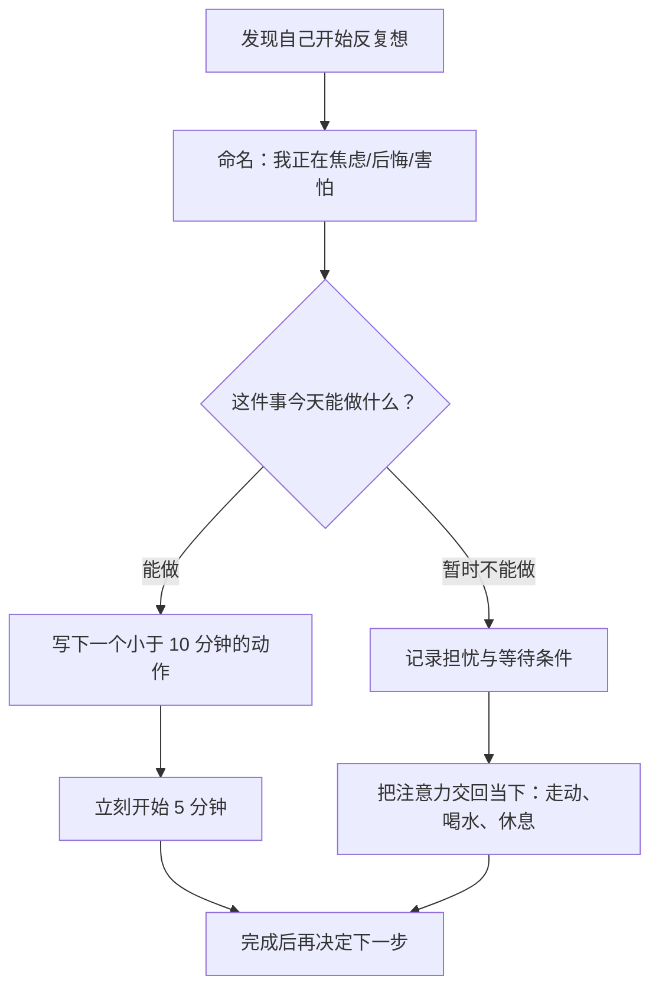

# 如何快速摆脱内耗

> [!abstract] 一句话
> 内耗通常不是「想得不够明白」，而是大脑在不确定、疲惫或害怕评价时，反复运行却没有产出行动。目标不是强行不想，而是把循环的念头转成一个足够小的下一步。

## 先判断：我卡在什么里？

用一句具体的话为当下状态命名，而不是笼统地下结论「我很糟」。

| 常见感受  | 可能的真实需要        | 可以对自己说                      |
| :---- | :------------- | :-------------------------- |
| 焦虑    | 缺少确定性或计划       | 「我担心的是 ___，下一步可确认的信息是 ___。」 |
| 后悔    | 希望修正过去         | 「过去已经发生；我能带走的经验是 ___。」      |
| 害怕被否定 | 自我价值被外部评价绑住    | 「这一次结果不等于我的全部价值。」           |
| 拖延、空转 | 任务过大、能量不足或标准过高 | 「先把任务缩小到五分钟。」               |
| 易怒、悲观 | 睡眠、饮食、运动或休息不足  | 「先补充资源，再解决问题。」              |

==情绪是信号，不是判决。==先识别它，才有机会选择回应方式。

## 60 秒止损流程

### 1. 命名，而非评判

例如：

- 不说：「我怎么又不行了。」
- 改说：「我在担心这份工作做得不够好。」

前者会扩大自责；后者让问题变得可观察、可处理。

### 2. 划分控制圈

把脑中内容写成两列：

| 我能影响的 | 我暂时无法控制的 |
| :--- | :--- |
| 今天是否发出消息、准备方案、完成一小段工作 | 别人会怎样评价、结果何时出现、已经发生的事 |

对左边：选择一个行动。对右边：写下需要等待的条件，然后暂停推演。

> [!tip] 有用的提问
> 「如果只允许做一件事来让情况变好 1%，那会是什么？」

### 3. 把行动缩小到荒谬地容易

内耗时不要问「怎样把整件事做好」，只问「接下来五分钟做什么」。

- 打开文档，只写标题。
- 只回复那一条最重要的消息。
- 把待办拆成三个动词开头的步骤。
- 穿上鞋，出门走十分钟。

开始带来信息和反馈；反复思考通常只会制造更多假设。

## 给反刍设一个边界

「别想了」往往无效，因为大脑会继续监测自己是否在想。可以改成下面的做法：

1. 每天预留 15 分钟，作为固定的「担忧时间」。
2. 反复念头出现时，记下一句话：我在担心什么？何时再回来看？
3. 对自己说：「这件事没有被忽略，今晚再处理。」
4. 将注意力放回正在做的一件具体小事。

这不是逃避，而是把思考从全天候的自动循环，变成有边界的主动处理。

## 先照顾身体，再处理人生问题

很多「我是不是哪里都做不好」会在睡眠不足、久坐、饥饿、长期刷信息后被放大。状态很差时，先完成一个基础修复：

- [ ] 喝水、吃一顿正常的饭
- [ ] 离开屏幕 10 分钟
- [ ] 快走或拉伸 5～15 分钟
- [ ] 把今天的睡眠时间往前挪一点
- [ ] 暂停信息流和无目的比较

> [!note]
> 身体恢复不一定能直接解决问题，但能降低问题在脑中占据的音量，让判断重新变得可靠。

## 替换自我批评的句式

| 自动想法 | 更准确的替换 |
| :--- | :--- |
| 「我怎么这么差」 | 「我现在资源不足，所以卡住了。」 |
| 「必须马上想明白」 | 「我可以先做一点，再根据反馈调整。」 |
| 「别人都比我强」 | 「我看到的是别人的结果，不是他们的全过程。」 |
| 「这次做不好就完了」 | 「这次结果重要，但它不是我的全部。」 |

## 一个可复用的晚间复盘

每天用 3 分钟回答：

1. 今天反复消耗我的一件事是什么？
2. 其中哪些在我的控制范围内？
3. 明天最小、最具体的一步是什么？
4. 我需要补充什么资源：睡眠、支持、信息，还是休息？

不要把复盘写成新的自我批评。它的作用是收尾：让大脑知道这件事已经被看见，也已有下一步。

## 何时应该寻求支持

如果这种状态持续两周以上，并显著影响睡眠、工作、食欲或日常功能，和心理咨询师或精神科医生聊聊是很实际的支持。若出现自伤或不想活下去的念头，请尽快联系身边可信任的人、当地紧急服务或专业危机干预资源。

> [!success] 今天的最低目标
> 不要求彻底摆脱内耗。只做一件能让自己从「脑内循环」回到「现实行动」的小事。
