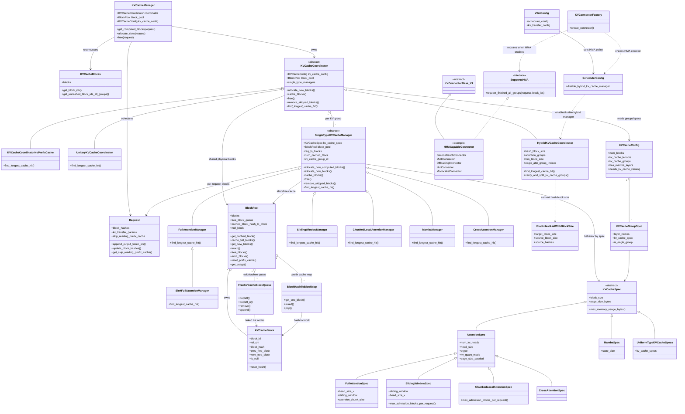

# KV Cache相关
## 整体架构

```mermaid
classDiagram
  direction TB

  %% =========================
  %% Scheduler-facing facade
  %% =========================

  class KVCacheManager {
    +KVCacheCoordinator coordinator
    +BlockPool block_pool
    +KVCacheConfig kv_cache_config
    +get_computed_blocks(request)
    +allocate_slots(request)
    +free(request)
  }

  class KVCacheBlocks {
    +blocks
    +get_block_ids()
    +get_unhashed_block_ids_all_groups()
  }

  class Request {
    +block_hashes
    +kv_transfer_params
    +skip_reading_prefix_cache
    +append_output_token_ids()
    +update_block_hashes()
    +get_skip_reading_prefix_cache()
  }

  KVCacheManager --> KVCacheCoordinator : owns
  KVCacheManager --> KVCacheBlocks : returns/uses
  KVCacheManager --> Request : schedules


  %% =========================
  %% Coordinator layer
  %% =========================

  class KVCacheCoordinator {
    <<abstract>>
    +KVCacheConfig kv_cache_config
    +BlockPool block_pool
    +single_type_managers
    +allocate_new_blocks()
    +cache_blocks()
    +free()
    +remove_skipped_blocks()
    +find_longest_cache_hit()*
  }

  class KVCacheCoordinatorNoPrefixCache {
    +find_longest_cache_hit()
  }

  class UnitaryKVCacheCoordinator {
    +find_longest_cache_hit()
  }

  class HybridKVCacheCoordinator {
    +hash_block_size
    +attention_groups
    +lcm_block_size
    +eagle_attn_group_indices
    +find_longest_cache_hit()
    +verify_and_split_kv_cache_groups()
  }

  KVCacheCoordinator <|-- KVCacheCoordinatorNoPrefixCache
  KVCacheCoordinator <|-- UnitaryKVCacheCoordinator
  KVCacheCoordinator <|-- HybridKVCacheCoordinator

  KVCacheCoordinator "1" o-- "*" SingleTypeKVCacheManager : per KV group
  KVCacheCoordinator --> BlockPool : shared physical blocks
  KVCacheCoordinator --> KVCacheConfig : reads groups/specs


  %% =========================
  %% Per-attention-type manager
  %% =========================

  class SingleTypeKVCacheManager {
    <<abstract>>
    +KVCacheSpec kv_cache_spec
    +BlockPool block_pool
    +req_to_blocks
    +num_cached_block
    +kv_cache_group_id
    +allocate_new_computed_blocks()
    +allocate_new_blocks()
    +cache_blocks()
    +free()
    +remove_skipped_blocks()
    +find_longest_cache_hit()*
  }

  class FullAttentionManager {
    +find_longest_cache_hit()
  }

  class SlidingWindowManager {
    +find_longest_cache_hit()
  }

  class ChunkedLocalAttentionManager {
    +find_longest_cache_hit()
  }

  class MambaManager {
    +find_longest_cache_hit()
  }

  class CrossAttentionManager {
    +find_longest_cache_hit()
  }

  class SinkFullAttentionManager {
    +find_longest_cache_hit()
  }

  SingleTypeKVCacheManager <|-- FullAttentionManager
  SingleTypeKVCacheManager <|-- SlidingWindowManager
  SingleTypeKVCacheManager <|-- ChunkedLocalAttentionManager
  SingleTypeKVCacheManager <|-- MambaManager
  SingleTypeKVCacheManager <|-- CrossAttentionManager
  FullAttentionManager <|-- SinkFullAttentionManager

  SingleTypeKVCacheManager --> BlockPool : alloc/free/cache
  SingleTypeKVCacheManager --> KVCacheSpec : behavior by spec
  SingleTypeKVCacheManager --> Request : per-request blocks


  %% =========================
  %% Physical block pool
  %% =========================

  class BlockPool {
    +blocks
    +free_block_queue
    +cached_block_hash_to_block
    +null_block
    +get_cached_block()
    +cache_full_blocks()
    +get_new_blocks()
    +touch()
    +free_blocks()
    +evict_blocks()
    +reset_prefix_cache()
    +get_usage()
  }

  class KVCacheBlock {
    +block_id
    +ref_cnt
    +block_hash
    +prev_free_block
    +next_free_block
    +is_null
    +reset_hash()
  }

  class FreeKVCacheBlockQueue {
    +popleft()
    +popleft_n()
    +remove()
    +append()
  }

  class BlockHashToBlockMap {
    +get_one_block()
    +insert()
    +pop()
  }

  class BlockHashListWithBlockSize {
    +target_block_size
    +source_block_size
    +source_hashes
  }

  BlockPool "1" o-- "*" KVCacheBlock : owns
  BlockPool "1" o-- "1" FreeKVCacheBlockQueue : eviction/free queue
  BlockPool "1" o-- "1" BlockHashToBlockMap : prefix cache map
  FreeKVCacheBlockQueue --> KVCacheBlock : linked list nodes
  BlockHashToBlockMap --> KVCacheBlock : hash to block
  HybridKVCacheCoordinator ..> BlockHashListWithBlockSize : convert hash block size


  %% =========================
  %% KV cache config/spec layer
  %% =========================

  class KVCacheConfig {
    +num_blocks
    +kv_cache_tensors
    +kv_cache_groups
    +has_mamba_layers
    +needs_kv_cache_zeroing
  }

  class KVCacheGroupSpec {
    +layer_names
    +kv_cache_spec
    +is_eagle_group
  }

  class KVCacheSpec {
    <<abstract>>
    +block_size
    +page_size_bytes
    +max_memory_usage_bytes()
  }

  class AttentionSpec {
    +num_kv_heads
    +head_size
    +dtype
    +kv_quant_mode
    +page_size_padded
  }

  class FullAttentionSpec {
    +head_size_v
    +sliding_window
    +attention_chunk_size
  }

  class SlidingWindowSpec {
    +sliding_window
    +head_size_v
    +max_admission_blocks_per_request()
  }

  class ChunkedLocalAttentionSpec {
    +max_admission_blocks_per_request()
  }

  class MambaSpec {
    +state_size
  }

  class CrossAttentionSpec {
  }

  class UniformTypeKVCacheSpecs {
    +kv_cache_specs
  }

  KVCacheConfig "1" o-- "*" KVCacheGroupSpec
  KVCacheGroupSpec --> KVCacheSpec

  KVCacheSpec <|-- AttentionSpec
  AttentionSpec <|-- FullAttentionSpec
  AttentionSpec <|-- SlidingWindowSpec
  AttentionSpec <|-- ChunkedLocalAttentionSpec
  AttentionSpec <|-- CrossAttentionSpec
  KVCacheSpec <|-- MambaSpec
  KVCacheSpec <|-- UniformTypeKVCacheSpecs


  %% =========================
  %% Config / HMA / KV transfer
  %% =========================

  class VllmConfig {
    +scheduler_config
    +kv_transfer_config
  }

  class SchedulerConfig {
    +disable_hybrid_kv_cache_manager
  }

  class KVConnectorFactory {
    +create_connector()
  }

  class KVConnectorBase_V1 {
    <<abstract>>
  }

  class SupportsHMA {
    <<interface>>
    +request_finished_all_groups(request, block_ids)
  }

  class HMACapableConnector {
    <<example>>
    DecodeBenchConnector
    MultiConnector
    OffloadingConnector
    NixlConnector
    MooncakeConnector
  }

  VllmConfig --> SchedulerConfig : sets HMA policy
  SchedulerConfig ..> HybridKVCacheCoordinator : enable/disable hybrid manager
  KVConnectorFactory ..> SchedulerConfig : checks HMA enabled
  KVConnectorFactory ..> SupportsHMA : requires when HMA enabled
  KVConnectorBase_V1 <|-- HMACapableConnector
  SupportsHMA <|.. HMACapableConnector

```
## KVCacheSpec
![[Drawing 2026-06-04 19.22.08.excalidraw|800]]

